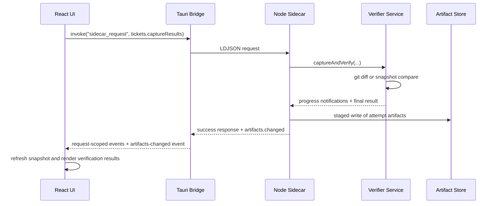
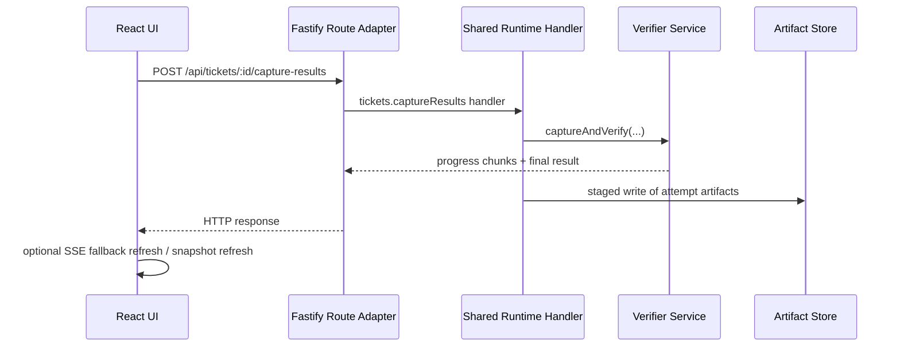
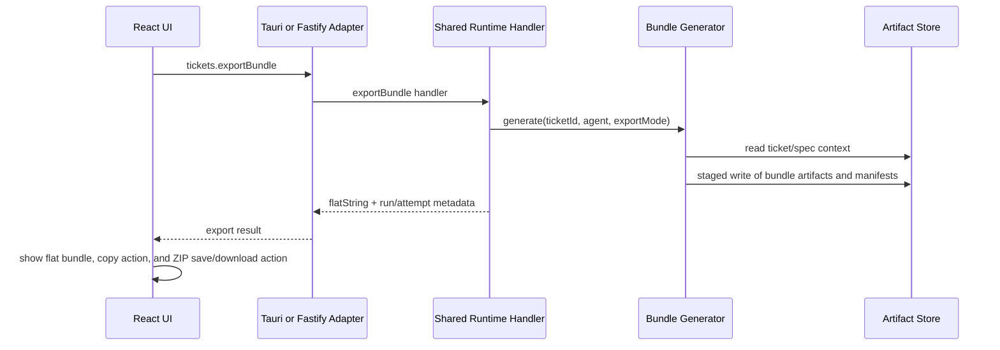

# Architecture - SpecFlow

Related docs:

- For setup and top-level command entry points, see [`../README.md`](../README.md)
- For desktop-first versus legacy web runtime behavior, see [`runtime-modes.md`](runtime-modes.md)
- For user workflow expectations and state transitions, see [`workflows.md`](workflows.md)
- For canonical UI terminology, see [`product-language-spec.md`](product-language-spec.md)

## Package Structure

Three packages share a single npm workspace root:

| Package | Contents | Runtime |
|---|---|---|
| `packages/app` | Node business logic, CLI entry points, Fastify fallback server, sidecar runtime | Node.js |
| `packages/client` | React + Vite SPA | Browser / Tauri webview |
| `packages/tauri` | Tauri v2 desktop shell and Rust bridge | Rust + Tauri |

Desktop is the primary runtime. `npm run tauri dev` is the explicit desktop development command, and `npm run dev` is an alias for it. The Tauri dev stack runs the app watcher, the Vite client dev server on `127.0.0.1:5173`, and the Tauri shell without a separate upfront build step; the desktop bridge waits for a fresh settled backend build under `packages/app/dist` before spawning the sidecar and hot-swaps to a fresh sidecar generation before the next request after a backend rebuild. In desktop mode, the UI does not talk to Fastify and normal usage does not bind an HTTP port.

Legacy Fastify + browser mode is still supported for fallback and compatibility. `npm run dev:web` starts the watched app server on `127.0.0.1:3142` plus the Vite client with `/api` proxying, and `specflow ui --legacy-web` runs the Fastify + browser runtime from source.

Shared TypeScript types (entity schemas, API contracts) live in `packages/app/src/types/` and are imported by both packages during development via path aliases.

---

## Runtime Topology

The desktop runtime is split into three layers:

1. The React UI in `packages/client`
2. The Tauri bridge in `packages/tauri`
3. A persistent Node sidecar in `packages/app/src/sidecar.ts`

The UI talks to Tauri through `invoke`, `Channel`, native dialog APIs, and Tauri events. Tauri spawns and manages the Node sidecar, keeps desktop dev attached to the freshest backend `dist` generation, forwards request/response traffic over line-delimited JSON, and forwards streamed sidecar notifications back to the webview.

The sidecar owns planning, verification, bundle export, store access, config updates, and GitHub issue import. Planner, verifier, bundle, store, and config logic remain in Node; Rust only owns desktop process management and transport bridging.

Fastify remains as a fallback adapter over the same shared runtime handlers. Route modules are intentionally thin adapters that translate HTTP requests and SSE streams into transport-agnostic handler calls.

---

## Artifact Store

On server startup, the store scans `specflow/` and loads all artifacts into typed in-memory maps (projects, tickets, runs, specs, config). All board API reads are served from memory -- no filesystem I/O per request. Mutations follow a **staged commit model**:

1. Build full operation output in a temp attempt directory (bundle files, snapshot, diff, verification output).
2. Validate integrity and write a temp manifest.
3. Atomically commit by updating the authoritative pointer/manifest in `run.yaml`.
4. Refresh in-memory maps from committed files.

A file watcher (chokidar) detects external edits and reloads affected artifacts into memory.
A dedicated reload helper validates planner-owned YAML on load, including planning reviews, trace outlines, and ticket coverage artifacts, before replacing the in-memory maps.

The sidecar emits `artifacts.changed` notifications after mutating operations. The desktop bridge converts those into Tauri events so the UI can refresh from the latest persisted snapshot instead of relying on long-lived global HTTP streams.

**Failure mode handling:** single-file writes use `.tmp` + atomic rename. Multi-file operations are never considered committed until the final pointer/manifest update succeeds. On startup, orphan temp attempt directories are detected and marked as recoverable leftovers.

Staged-commit edge-case rules:
- Writes are serialized with a per-run lock; concurrent operations against the same run are rejected with a retryable conflict error.
- Each staged operation has `operationLeaseExpiresAt`; expired operations are treated as abandoned.
- Recovery on startup:
  - `activeOperationId` present + committed pointer missing + tmp exists -> mark `abandoned`
  - `activeOperationId` present + committed pointer already advanced -> mark `superseded`
  - tmp missing but active pointer present -> mark `failed` and clear active pointer
- Cleanup: abandoned/superseded temp directories are retained for a bounded TTL, then pruned by a background task.

---

## CLI as Thin Wrapper

`specflow ui` is desktop-first. It launches the desktop binary when available and only falls back to the legacy Fastify + browser runtime with a deprecation warning when the desktop runtime is unavailable or explicitly bypassed with `--legacy-web`.

`specflow verify` and `specflow export-bundle` keep the existing **prefer-server** execution strategy:

- If the server is running, the CLI delegates mutating operations to server APIs.
- If the server is not running, the CLI executes locally in-process using the same service layer.

The CLI probes `/api/runtime/status` and checks capability + protocol version before delegating. If the server is reachable but the check fails, mutating commands **fail closed** (no local fallback) to avoid split-brain writes. Delegated requests include an `operationId` idempotency key; if the CLI times out, it queries operation state before retrying.

---

## Shared Runtime and Transport

Core backend behavior is extracted into transport-agnostic runtime handlers under `packages/app/src/runtime/handlers/`. These handlers accept validated typed input plus optional progress and notification sinks, and they return plain typed results or structured handler errors.

Two transports adapt those handlers:

- Fastify route modules for the legacy web runtime
- The sidecar JSON-RPC dispatcher for the desktop runtime

The shared sidecar contract uses correlated request/response envelopes plus request-scoped notifications. Mutating methods also trigger global artifact change notifications so the UI can refresh snapshot state after writes.

The browser never calls provider APIs directly. In legacy web mode, AI operations stream through Fastify SSE adapters. In desktop mode, AI operations stream through request-scoped Tauri channels backed by sidecar notifications. The UI refresh model stays snapshot-based: on disconnect or completion, it fetches the latest committed state rather than attempting event replay.

---

## Workflow Contract and Execution Gates

Planning workflow metadata lives in one shared contract module: `packages/app/src/planner/workflow-contract.ts`. Step order, review kinds, labels, source-step ownership, and prerequisite review rules are defined there and imported by both the server and client so the project workspace cannot drift from backend gating behavior.

Project-linked execution gating is centralized in `packages/app/src/planner/execution-gates.ts`. Ticket status transitions and bundle export both use the same helper, so the rule "resolve the coverage check before starting execution" is enforced consistently across server routes and surfaced with the same message in the UI.

For the user-facing version of these workflow rules, see [`workflows.md`](workflows.md).

---

## Bundle Duality

`specflow export-bundle` writes a **directory bundle** to `specflow/runs/<run-id>/attempts/<attempt-id>/bundle/`. The board's Export Bundle panel calls an API endpoint that returns the same content as a **flattened clipboard string**. Both are generated by the same Bundle Generator service.

Desktop mode replaces the legacy HTTP ZIP download anchor with a native save flow. The client asks the user for a destination path through the Tauri dialog plugin, then Tauri forwards a `runs.saveBundleZip` sidecar request that writes the ZIP to the chosen filesystem path without exposing a temporary HTTP download endpoint.

Bundle contracts are versioned: every bundle includes a manifest with `bundleSchemaVersion`, `agentTarget`, and `exportMode` (standard vs quick-fix). Quick-fix exports include source linkage metadata (`sourceRunId`, `sourceFindingId`) for audit traceability. For project-linked tickets, `PROMPT.md` also surfaces the ticket's covered spec items before the acceptance criteria so the agent sees the originating requirement and flow context, not only the ticket summary. Coverage-gated project tickets cannot export until the shared execution-gate helper reports that the project's coverage review is resolved. Agent renderers are validated by golden tests against fixed fixtures.

---

## Verification Strategy

The Diff Engine checks for a git repo first. If found, uses `git diff`. If not, uses the file snapshot captured at Export Bundle time.

No-git verification uses a **two-stage scope + dual-diff model**:
- **Initial scope** is selected and baselined at export.
- **Capture-time widening** is allowed, but widened files are drift-only context.
- **Primary diff:** baseline-at-export vs capture-time state for the initial scope (used for verification).
- **Drift diff:** pre-capture local changes and widened-scope deltas surfaced as warnings.

The Verifier LLM receives the primary diff, acceptance criteria, and `specflow/AGENTS.md` and returns structured results per criterion including `pass`, `evidence`, `severity`, and `remediationHint`. Drift diff warnings are shown alongside verification output.

---

## Data Model

### File Layout

```text
.env                               # provider secrets (OPENAI_API_KEY, etc.)
specflow/
  config.yaml                        # provider, model, host, port, repoInstructionFile (non-secret)
  AGENTS.md                          # repo instruction file (conventions)
  initiatives/                      # persisted project artifacts (legacy path name retained internally)
    <id>/
      initiative.yaml                # project metadata, workflow state, phase list
      brief.md
      core-flows.md
      prd.md
      tech-spec.md
      reviews/
        brief-review.yaml
        brief-core-flows-crosscheck.yaml
        core-flows-review.yaml
        core-flows-prd-crosscheck.yaml
        prd-review.yaml
        prd-tech-spec-crosscheck.yaml
        tech-spec-review.yaml
        spec-set-review.yaml
        ticket-coverage-review.yaml
      coverage/
        tickets.yaml
      traces/
        brief.yaml
        core-flows.yaml
        prd.yaml
        tech-spec.yaml
  tickets/
    <id>.yaml                        # all ticket fields including blockedBy/blocks
  runs/
    <id>/
      run.yaml                       # run metadata, committed attempt pointer
      attempts/
        <attempt-id>/
          bundle/                    # directory bundle (CLI)
            PROMPT.md
            AGENTS.md
            <referenced-spec-files>
          bundle-flat.md             # flattened clipboard version
          bundle-manifest.yaml       # versioned contract metadata
          snapshot-before/           # no-git baseline (file targets only)
          diff-primary.patch         # verification diff
          diff-drift.patch           # pre-capture local drift warning diff
          verification.json          # structured pass/fail results
      _tmp/
        <operation-id>/              # staged commit workspace (not yet committed)
          operation-manifest.yaml    # operation state + lease + validation
          ...
  decisions/
    <id>.md
```

### Core Entities

**Project**
```yaml
id: string
title: string
description: string          # original free-text input
status: draft | active | done
phases:
  - id: string
    name: string
    order: number
    status: active | complete
specIds: string[]
ticketIds: string[]
workflow:
  activeStep: brief | core-flows | prd | tech-spec | validation | tickets
  resumeTicketId: string | null
  steps:
    brief:
      status: locked | ready | complete | stale
      updatedAt: ISO8601 | null
    core-flows:
      status: locked | ready | complete | stale
      updatedAt: ISO8601 | null
    prd:
      status: locked | ready | complete | stale
      updatedAt: ISO8601 | null
    tech-spec:
      status: locked | ready | complete | stale
      updatedAt: ISO8601 | null
    validation:
      status: locked | ready | complete | stale
      updatedAt: ISO8601 | null
    tickets:
      status: locked | ready | complete | stale
      updatedAt: ISO8601 | null
  refinements:
    brief | core-flows | prd | tech-spec:
      questions: PlannerQuestion[]
      history: PlannerQuestion[]
      answers: Record<string, string | string[] | boolean>
      defaultAnswerQuestionIds: string[]
      baseAssumptions: string[]
      preferredSurface: questions | review | null
      checkedAt: ISO8601 | null
createdAt: ISO8601
updatedAt: ISO8601
```

Planner refinement checks now consume both the flattened saved answers and the persisted refinement question history for the current and earlier stages. Each refinement step stores the current blocker set in `questions` plus a durable `history` list that survives artifact generation, so completed phases can still reopen the exact answered survey later without losing blocker provenance. Refinement state also stores a `preferredSurface` value so the project route and Home resume links can restore the last meaningful planning surface for that phase. Artifact completion resets that preference to `review`, while an intentional `Back` or reopen flow can persist `questions` again later. The project workflow also stores a `resumeTicketId` so execution re-entry can reopen the active project ticket instead of re-deriving it from ticket sorting alone. Run detail stays explicit history: visiting a run report does not replace the ticket as the project's default execution resume target. That lets later checks see the original blocker questions, avoid same-stage duplicate re-asks, and reopen an earlier concern only when a real downstream constraint still blocks the next artifact. Reopened questions now carry explicit `reopensQuestionIds` references so cross-stage follow-ups are structural instead of prompt-only, and the client can render the earlier step/question/answer context inline when a blocker revisits prior work. PRD checks can receive lightweight repo context when earlier artifacts already indicate existing-system or compatibility work, while Tech spec checks and generation continue to receive repo context when existing-system, compatibility, failure-handling, performance, quality-strategy, or operations constraints matter. The planner now treats `quality-strategy` as the canonical tech-spec decision type and accepts legacy `verification` values as a compatibility alias.

**Ticket**
```yaml
id: string
initiativeId: string | null  # null for Quick tasks
phaseId: string | null
title: string
description: string
status: backlog | ready | in-progress | verify | done
acceptanceCriteria:
  - id: string
    text: string
implementationPlan: string   # Markdown
fileTargets: string[]        # relative paths
coverageItemIds: string[]    # project coverage ledger items this ticket is expected to satisfy
blockedBy: string[]          # ticket IDs that must be done before this one starts
blocks: string[]             # ticket IDs that this one blocks
runId: string | null         # current active run
createdAt: ISO8601
updatedAt: ISO8601
```

**PlanningReviewArtifact**
```yaml
id: string                    # initiativeId:kind
initiativeId: string
kind: brief-review | brief-core-flows-crosscheck | core-flows-review | core-flows-prd-crosscheck | prd-review | prd-tech-spec-crosscheck | tech-spec-review | spec-set-review | ticket-coverage-review
status: passed | blocked | overridden | stale
summary: string
findings:
  - id: string
    type: blocker | warning | traceability-gap | assumption | recommended-fix
    message: string
    relatedArtifacts: [brief | core-flows | prd | tech-spec | tickets]
sourceUpdatedAts:
  brief?: ISO8601
  core-flows?: ISO8601
  prd?: ISO8601
  tech-spec?: ISO8601
  tickets?: ISO8601
overrideReason: string | null
reviewedAt: ISO8601
updatedAt: ISO8601
```

**ArtifactTraceOutline**
```yaml
id: string                    # initiativeId:step
initiativeId: string
step: brief | core-flows | prd | tech-spec
sections:
  - key: string
    label: string
    items: string[]
sourceUpdatedAt: ISO8601
generatedAt: ISO8601
updatedAt: ISO8601
```

**TicketCoverageArtifact**
```yaml
id: string                    # initiativeId:ticket-coverage
initiativeId: string
items:
  - id: string
    sourceStep: brief | core-flows | prd | tech-spec
    sectionKey: string
    sectionLabel: string
    kind: string
    text: string
uncoveredItemIds: string[]
sourceUpdatedAts:
  brief?: ISO8601
  core-flows?: ISO8601
  prd?: ISO8601
  tech-spec?: ISO8601
  tickets?: ISO8601
generatedAt: ISO8601
updatedAt: ISO8601
```

**Run + RunAttempt**
```yaml
# run.yaml
id: string
ticketId: string | null      # null for standalone audits
type: execution | audit
agentType: claude-code | codex-cli | opencode | generic
status: pending | complete
attempts: string[]           # ordered attempt IDs
committedAttemptId: string | null
activeOperationId: string | null    # non-null only during staged commit
operationLeaseExpiresAt: ISO8601 | null
lastCommittedAt: ISO8601 | null
createdAt: ISO8601

# attempts/<id>/verification.json
attemptId: string
agentSummary: string
diffSource: git | snapshot
initialScopePaths: string[]
widenedScopePaths: string[]
primaryDiffPath: string
driftDiffPath: string | null
overrideReason: string | null
overrideAccepted: boolean
criteriaResults:
  - criterionId: string
    pass: boolean
    evidence: string
    severity: Critical | Major | Minor | Outdated
    remediationHint: string | null
driftFlags:
  - type: unexpected-file | missing-requirement | pre-capture-drift | widened-scope-drift
    file: string
    description: string
overallPass: boolean
createdAt: ISO8601
```

**AuditFinding** (within the audit report for audit-type runs)
```yaml
findings:
  - id: string
    category: drift | acceptance | convention | bug | performance | security | clarity
    severity: error | warning | info
    confidence: number | null       # 0-1, present when LLM-generated
    description: string
    file: string
    line: number | null
    dismissed: boolean
    dismissNote: string | null
```

**Config**
```yaml
provider: anthropic | openai | openrouter
model: string                # e.g. claude-opus-4-6, gpt-4o, openrouter/auto
port: number                 # default 3141
host: string                 # default 127.0.0.1
repoInstructionFile: string  # default specflow/AGENTS.md
```

Provider secrets are stored separately in repo-root `.env`. Settings writes use a dedicated secret-save path (`config.saveProviderKey` / `PUT /api/config/provider-key`) that updates `.env`, refreshes `process.env`, and never returns the raw key. Legacy `apiKey` fields found in `specflow/config.yaml` are auto-migrated into `.env` and scrubbed on startup.

**BundleManifest**
```yaml
bundleSchemaVersion: string
rendererVersion: string
agentTarget: claude-code | codex-cli | opencode | generic
exportMode: standard | quick-fix
ticketId: string | null
runId: string
attemptId: string
sourceRunId: string | null       # present for quick-fix from audit findings
sourceFindingId: string | null   # present for quick-fix from audit findings
contextFiles: string[]
requiredFiles: string[]
contentDigest: string
generatedAt: ISO8601
```

**OperationManifest**
```yaml
operationId: string
runId: string
targetAttemptId: string
state: prepared | committed | abandoned | superseded | failed
leaseExpiresAt: ISO8601
validation:
  passed: boolean
  details: string | null
preparedAt: ISO8601
updatedAt: ISO8601
```

### Entity Relationships


---

## Component Architecture

### packages/app - Backend and CLI

| Component | Responsibility |
|---|---|
| **CLI entry (`src/cli.ts`)** | Parses `ui`, `export-bundle`, and `verify`; keeps `export-bundle` and `verify` on the prefer-server delegation path; launches desktop first for `ui` and falls back to legacy web only when needed |
| **Shared runtime factory (`src/runtime/create-runtime.ts`)** | Composes `ArtifactStore`, planner, verifier, bundle generator, diff engine, and config/runtime dependencies once for sidecar or Fastify usage |
| **Runtime handlers (`src/runtime/handlers/*`)** | Transport-agnostic application operations grouped by domain; return plain typed results or structured handler errors |
| **Sidecar dispatcher (`src/sidecar/dispatcher.ts`)** | Maps JSON-RPC method names to shared runtime handlers; emits request-scoped progress plus `artifacts.changed` notifications |
| **Sidecar entrypoint (`src/sidecar.ts`)** | Long-lived line-delimited JSON process that powers desktop mode |
| **Fastify server (`src/server/create-server.ts`)** | Legacy web composition root; mounts HTTP and SSE adapters over the shared runtime handlers |
| **Route adapters (`src/server/routes/*`)** | Parse HTTP input, validate IDs/paths, set up legacy SSE where needed, and shape HTTP responses |
| **Artifact store (`src/store/*`)** | In-memory read model plus staged-commit persistence layer for `specflow/` |
| **Planner / verifier / bundle / audit modules** | Own planning workflow, verification semantics, bundle rendering, and drift-audit behavior without transport coupling |

### packages/client - Presentation Layer

| Component | Responsibility |
|---|---|
| **`App.tsx`** | Holds the top-level `ArtifactsSnapshot`, refreshes persisted state, and subscribes to desktop artifact-change events |
| **Transport adapter (`src/api/transport.ts`)** | Switches between desktop transport (`invoke`, `Channel`, native dialogs, Tauri events) and legacy web transport (`fetch`, SSE, HTTP downloads) |
| **API modules (`src/api/*`)** | Keep domain-level client APIs stable while routing them through the active transport |
| **Workspace shell + navigation** | Provide the collapsing/expanding left sidebar, command palette, and route-level workspace structure |
| **Project / ticket / run views** | Render planning, execution, and verification flows using backend-owned workflow and verification state |
| **Execution hooks** | Manage local UI concerns such as verification log display, capture preview debouncing, export workflow state, and error toasts |

### packages/tauri - Desktop Bridge

| Component | Responsibility |
|---|---|
| **Rust bridge (`src-tauri/src/lib.rs`)** | Spawns the Node sidecar, forwards request/response traffic, relays progress events, emits `artifacts-changed`, and drains pending requests on disconnect |
| **Tauri config (`tauri.conf.json`)** | Production build configuration, including frontend assets and packaged sidecar binary |
| **Dev config (`tauri.dev.conf.json`)** | Dev-only overlay that disables `externalBin` so `tauri dev` can use the Node `dist/sidecar.js` flow instead of requiring a packaged sidecar |
| **Workspace scripts (`packages/tauri/package.json`)** | Own the desktop dev stack through `beforeDevCommand`, including the app/client watch processes and watcher-first sidecar startup |

---

## Transport Surfaces

### Desktop sidecar method families

The desktop runtime uses correlated JSON-RPC requests over stdin/stdout between Tauri and the Node sidecar. Current method families:

| Namespace | Purpose |
|---|---|
| `runtime.*` / `artifacts.*` | Runtime status and full snapshot reads |
| `config.*` / `providers.*` | Non-secret settings writes, provider-key saves, and provider model discovery |
| `operations.*` | Operation-status probing for idempotent retries |
| `initiatives.*` | Project workflow actions, reviews, and ticket-plan generation |
| `tickets.*` | Ticket CRUD, bundle export, capture preview, verification, and override flows |
| `runs.*` | Run list/detail/state plus desktop ZIP save |
| `audit.*` | Drift audit execution and finding actions |
| `import.*` | GitHub Issue import |

### Legacy HTTP surface

Legacy web mode retains the corresponding `/api/...` routes as adapters over the same runtime handlers. HTTP remains supported for:

- browser fallback
- jsdom/browser-oriented tests
- existing CLI server delegation
- explicit compatibility workflows such as legacy ZIP download

Only legacy web mode uses Fastify-bound HTTP and SSE during normal interaction.

---

## End-to-End Request Trace: Desktop Verification



## End-to-End Request Trace: Legacy Web Verification



## End-to-End Request Trace: Bundle Export


