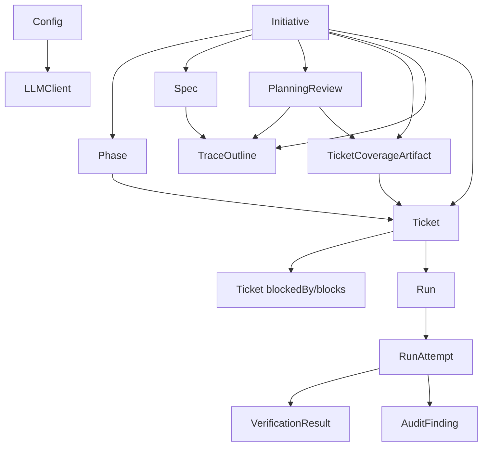
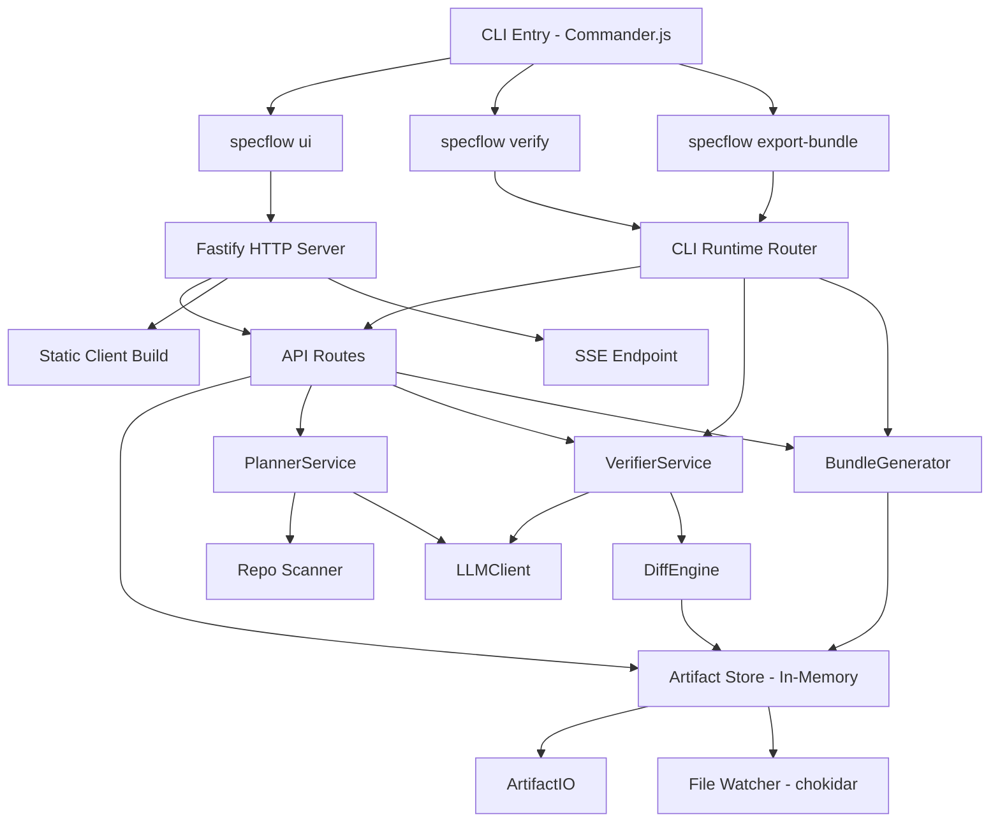
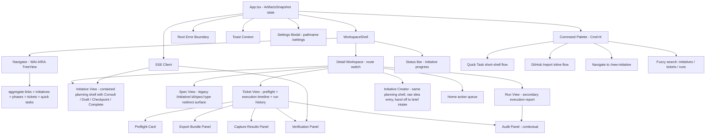
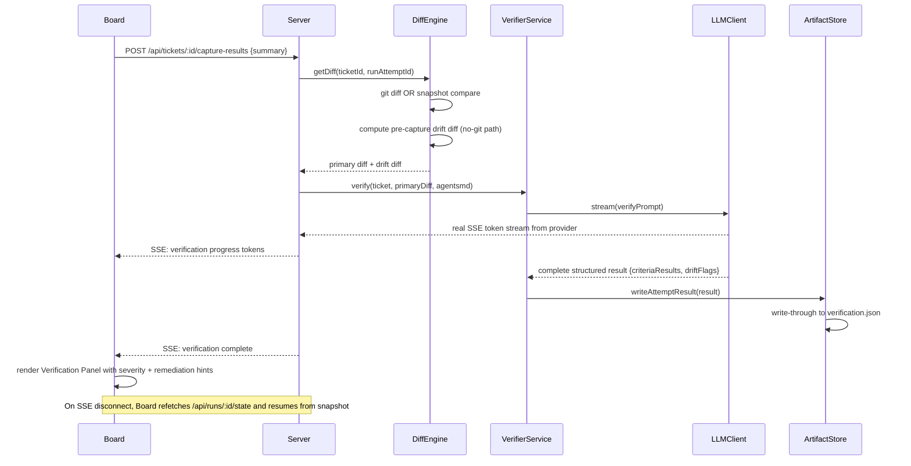
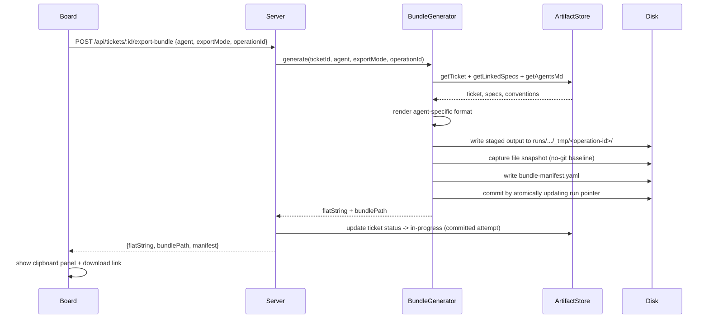

# Architecture - SpecFlow

## Package Structure

Two packages sharing a single npm workspace root:

| Package | Contents | Runtime |
|---|---|---|
| `packages/app` | Fastify server, CLI entry points, all core services | Node.js |
| `packages/client` | React + Vite SPA | Browser |

In production mode, the server builds the client SPA and serves it as static files. There is no separate deployment step -- `specflow ui` starts one process that serves everything. In development mode, `npm run dev` starts a watched app server on `127.0.0.1:3142` and a Vite client on `127.0.0.1:5173`; the Vite client proxies `/api` requests to the watched backend. Shared TypeScript types (entity schemas, API contracts) live in `packages/app/src/types/` and are imported by both packages during development via path aliases.

---

## Artifact Store

On server startup, the store scans `specflow/` and loads all artifacts into typed in-memory maps (initiatives, tickets, runs, specs, config). All board API reads are served from memory -- no filesystem I/O per request. Mutations follow a **staged commit model**:

1. Build full operation output in a temp attempt directory (bundle files, snapshot, diff, verification output).
2. Validate integrity and write a temp manifest.
3. Atomically commit by updating the authoritative pointer/manifest in `run.yaml`.
4. Refresh in-memory maps from committed files.

A file watcher (chokidar) detects external edits and reloads affected artifacts into memory.
A dedicated reload helper validates planner-owned YAML on load, including planning reviews, trace outlines, and ticket coverage artifacts, before replacing the in-memory maps.

**Failure mode handling:** single-file writes use `.tmp` + atomic rename. Multi-file operations are never considered committed until the final pointer/manifest update succeeds. On startup, orphan temp attempt directories are detected and marked as recoverable leftovers.

Staged-commit edge-case rules:
- Writes are serialized with a per-run lock; concurrent operations against the same run are rejected with a retryable conflict error.
- Each staged operation has `operationLeaseExpiresAt`; expired operations are treated as abandoned.
- Recovery on startup:
  - `activeOperationId` present + committed pointer missing + tmp exists -> mark `abandoned`
  - `activeOperationId` present + committed pointer already advanced -> mark `superseded`
  - tmp missing but active pointer present -> mark `failed` and clear active pointer
- Cleanup: abandoned/superseded temp directories are retained for a bounded TTL, then pruned by a background task.

---

## CLI as Thin Wrapper

`specflow ui` starts the Fastify server and opens the browser. `specflow verify` and `specflow export-bundle` use a **prefer-server** execution strategy:

- If the server is running, the CLI delegates mutating operations to server APIs.
- If the server is not running, the CLI executes locally in-process using the same service layer.

The CLI probes `/api/runtime/status` and checks capability + protocol version before delegating. If the server is reachable but the check fails, mutating commands **fail closed** (no local fallback) to avoid split-brain writes. Delegated requests include an `operationId` idempotency key; if the CLI times out, it queries operation state before retrying.

---

## LLM Calls Through Server Only

The browser never calls the LLM API directly. All AI operations (Planner, Verifier, Audit) go through Fastify API routes. The server reads provider API keys from `.env` and keeps those keys out of client payloads. Responses stream back to the client via Server-Sent Events (SSE) using real provider streaming APIs (not simulated).

SSE reconnection is non-resumable with snapshot refresh: on disconnect, the client reconnects and immediately fetches latest state via REST. UI resumes from current persisted state (no event replay buffer).

---

## Workflow Contract and Execution Gates

Planning workflow metadata lives in one shared contract module: `packages/app/src/planner/workflow-contract.ts`. Step order, review kinds, labels, source-step ownership, and prerequisite review rules are defined there and imported by both the server and client so the initiative workspace cannot drift from backend gating behavior.

Initiative-linked execution gating is centralized in `packages/app/src/planner/execution-gates.ts`. Ticket status transitions and bundle export both use the same helper, so the rule "resolve the coverage check before starting execution" is enforced consistently across server routes and surfaced with the same message in the UI.

---

## Bundle Duality

`specflow export-bundle` writes a **directory bundle** to `specflow/runs/<run-id>/attempts/<attempt-id>/bundle/`. The board's Export Bundle panel calls an API endpoint that returns the same content as a **flattened clipboard string**. Both are generated by the same Bundle Generator service.

Bundle contracts are versioned: every bundle includes a manifest with `bundleSchemaVersion`, `agentTarget`, and `exportMode` (standard vs quick-fix). Quick-fix exports include source linkage metadata (`sourceRunId`, `sourceFindingId`) for audit traceability. For initiative-linked tickets, `PROMPT.md` also surfaces the ticket's covered spec items before the acceptance criteria so the agent sees the originating requirement and flow context, not only the ticket summary. Coverage-gated initiative tickets cannot export until the shared execution-gate helper reports that the initiative's coverage review is resolved. Agent renderers are validated by golden tests against fixed fixtures.

---

## Verification Strategy

The Diff Engine checks for a git repo first. If found, uses `git diff`. If not, uses the file snapshot captured at Export Bundle time.

No-git verification uses a **two-stage scope + dual-diff model**:
- **Initial scope** is selected and baselined at export.
- **Capture-time widening** is allowed, but widened files are drift-only context.
- **Primary diff:** baseline-at-export vs capture-time state for the initial scope (used for verification).
- **Drift diff:** pre-capture local changes and widened-scope deltas surfaced as warnings.

The Verifier LLM receives the primary diff, acceptance criteria, and `specflow/AGENTS.md` and returns structured results per criterion including `pass`, `evidence`, `severity`, and `remediationHint`. Drift diff warnings are shown alongside verification output.

---

## Data Model

### File Layout

```text
specflow/
  config.yaml                        # provider, model, host, port, repoInstructionFile (non-secret)
  AGENTS.md                          # repo instruction file (conventions)
  initiatives/
    <id>/
      initiative.yaml                # metadata, workflow state, phase list
      brief.md
      core-flows.md
      prd.md
      tech-spec.md
      reviews/
        brief-review.yaml
        brief-core-flows-crosscheck.yaml
        core-flows-review.yaml
        core-flows-prd-crosscheck.yaml
        prd-review.yaml
        prd-tech-spec-crosscheck.yaml
        tech-spec-review.yaml
        spec-set-review.yaml
        ticket-coverage-review.yaml
      coverage/
        tickets.yaml
      traces/
        brief.yaml
        core-flows.yaml
        prd.yaml
        tech-spec.yaml
  tickets/
    <id>.yaml                        # all ticket fields including blockedBy/blocks
  runs/
    <id>/
      run.yaml                       # run metadata, committed attempt pointer
      attempts/
        <attempt-id>/
          bundle/                    # directory bundle (CLI)
            PROMPT.md
            AGENTS.md
            <referenced-spec-files>
          bundle-flat.md             # flattened clipboard version
          bundle-manifest.yaml       # versioned contract metadata
          snapshot-before/           # no-git baseline (file targets only)
          diff-primary.patch         # verification diff
          diff-drift.patch           # pre-capture local drift warning diff
          verification.json          # structured pass/fail results
      _tmp/
        <operation-id>/              # staged commit workspace (not yet committed)
          operation-manifest.yaml    # operation state + lease + validation
          ...
  decisions/
    <id>.md
```

### Core Entities

**Initiative**
```yaml
id: string
title: string
description: string          # original free-text input
status: draft | active | done
phases:
  - id: string
    name: string
    order: number
    status: active | complete
specIds: string[]
ticketIds: string[]
workflow:
  activeStep: brief | core-flows | prd | tech-spec | tickets
  steps:
    brief:
      status: locked | ready | complete | stale
      updatedAt: ISO8601 | null
    core-flows:
      status: locked | ready | complete | stale
      updatedAt: ISO8601 | null
    prd:
      status: locked | ready | complete | stale
      updatedAt: ISO8601 | null
    tech-spec:
      status: locked | ready | complete | stale
      updatedAt: ISO8601 | null
    tickets:
      status: locked | ready | complete | stale
      updatedAt: ISO8601 | null
  refinements:
    brief | core-flows | prd | tech-spec:
      questions: PlannerQuestion[]
      answers: Record<string, string | string[] | boolean>
      defaultAnswerQuestionIds: string[]
      baseAssumptions: string[]
      checkedAt: ISO8601 | null
createdAt: ISO8601
updatedAt: ISO8601
```

**Ticket**
```yaml
id: string
initiativeId: string | null  # null for Quick Tasks
phaseId: string | null
title: string
description: string
status: backlog | ready | in-progress | verify | done
acceptanceCriteria:
  - id: string
    text: string
implementationPlan: string   # Markdown
fileTargets: string[]        # relative paths
coverageItemIds: string[]    # initiative coverage ledger items this ticket is expected to satisfy
blockedBy: string[]          # ticket IDs that must be done before this one starts
blocks: string[]             # ticket IDs that this one blocks
runId: string | null         # current active run
createdAt: ISO8601
updatedAt: ISO8601
```

**PlanningReviewArtifact**
```yaml
id: string                    # initiativeId:kind
initiativeId: string
kind: brief-review | brief-core-flows-crosscheck | core-flows-review | core-flows-prd-crosscheck | prd-review | prd-tech-spec-crosscheck | tech-spec-review | spec-set-review | ticket-coverage-review
status: passed | blocked | overridden | stale
summary: string
findings:
  - id: string
    type: blocker | warning | traceability-gap | assumption | recommended-fix
    message: string
    relatedArtifacts: [brief | core-flows | prd | tech-spec | tickets]
sourceUpdatedAts:
  brief?: ISO8601
  core-flows?: ISO8601
  prd?: ISO8601
  tech-spec?: ISO8601
  tickets?: ISO8601
overrideReason: string | null
reviewedAt: ISO8601
updatedAt: ISO8601
```

**ArtifactTraceOutline**
```yaml
id: string                    # initiativeId:step
initiativeId: string
step: brief | core-flows | prd | tech-spec
sections:
  - key: string
    label: string
    items: string[]
sourceUpdatedAt: ISO8601
generatedAt: ISO8601
updatedAt: ISO8601
```

**TicketCoverageArtifact**
```yaml
id: string                    # initiativeId:ticket-coverage
initiativeId: string
items:
  - id: string
    sourceStep: brief | core-flows | prd | tech-spec
    sectionKey: string
    sectionLabel: string
    kind: string
    text: string
uncoveredItemIds: string[]
sourceUpdatedAts:
  brief?: ISO8601
  core-flows?: ISO8601
  prd?: ISO8601
  tech-spec?: ISO8601
  tickets?: ISO8601
generatedAt: ISO8601
updatedAt: ISO8601
```

**Run + RunAttempt**
```yaml
# run.yaml
id: string
ticketId: string | null      # null for standalone audits
type: execution | audit
agentType: claude-code | codex-cli | opencode | generic
status: pending | complete
attempts: string[]           # ordered attempt IDs
committedAttemptId: string | null
activeOperationId: string | null    # non-null only during staged commit
operationLeaseExpiresAt: ISO8601 | null
lastCommittedAt: ISO8601 | null
createdAt: ISO8601

# attempts/<id>/verification.json
attemptId: string
agentSummary: string
diffSource: git | snapshot
initialScopePaths: string[]
widenedScopePaths: string[]
primaryDiffPath: string
driftDiffPath: string | null
overrideReason: string | null
overrideAccepted: boolean
criteriaResults:
  - criterionId: string
    pass: boolean
    evidence: string
    severity: Critical | Major | Minor | Outdated
    remediationHint: string | null
driftFlags:
  - type: unexpected-file | missing-requirement | pre-capture-drift | widened-scope-drift
    file: string
    description: string
overallPass: boolean
createdAt: ISO8601
```

**AuditFinding** (within the audit report for audit-type runs)
```yaml
findings:
  - id: string
    category: drift | acceptance | convention | bug | performance | security | clarity
    severity: error | warning | info
    confidence: number | null       # 0-1, present when LLM-generated
    description: string
    file: string
    line: number | null
    dismissed: boolean
    dismissNote: string | null
```

**Config**
```yaml
provider: anthropic | openai | openrouter
model: string                # e.g. claude-opus-4-6, gpt-4o, openrouter/auto
apiKey?: string              # optional legacy fallback; prefer environment variables
port: number                 # default 3141
host: string                 # default 127.0.0.1
repoInstructionFile: string  # default specflow/AGENTS.md
```

**BundleManifest**
```yaml
bundleSchemaVersion: string
rendererVersion: string
agentTarget: claude-code | codex-cli | opencode | generic
exportMode: standard | quick-fix
ticketId: string | null
runId: string
attemptId: string
sourceRunId: string | null       # present for quick-fix from audit findings
sourceFindingId: string | null   # present for quick-fix from audit findings
contextFiles: string[]
requiredFiles: string[]
contentDigest: string
generatedAt: ISO8601
```

**OperationManifest**
```yaml
operationId: string
runId: string
targetAttemptId: string
state: prepared | committed | abandoned | superseded | failed
leaseExpiresAt: ISO8601
validation:
  passed: boolean
  details: string | null
preparedAt: ISO8601
updatedAt: ISO8601
```

### Entity Relationships



---

## Component Architecture

### packages/app - Server + CLI



**Component responsibilities:**

| Component | Responsibility |
|---|---|
| **CLI Entry** | Parses commands; delegates mutating commands to running server when available; fail-closed on protocol mismatch; local fallback only when server absent |
| **Fastify Server** | HTTP + SSE, serves static client build, mounts API routes |
| **API Routes** | REST endpoints for all CRUD + action operations; streams SSE for LLM jobs |
| **Artifact Store** | Typed in-memory maps; staged commit orchestrator; delegates artifact writing to `artifact-writer.ts`, spec filename mapping to `spec-utils.ts`, reload assembly to `reload.ts`, planner artifact validation to `planning-artifact-validation.ts`, and chokidar file watching with debounced reload to `watcher.ts` |
| **Artifact IO** | Reads/writes YAML + Markdown; enforces `specflow/` directory layout; atomic writes via temp-rename |
| **Planner Service** | Thin orchestration layer that delegates spec generation, review execution, plan generation, coverage handling, and structured error shaping to focused planner modules; injects repo context from Repo Scanner; persists review, trace, and coverage artifacts |
| **Repo Scanner** | Runs `git ls-files` + reads key config files; produces a condensed file tree for plan prompt grounding |
| **Verifier Service** | Assembles primary diff + drift diff + criteria + AGENTS.md; parses per-criterion results including severity and remediation hints |
| **Diff Engine** | Git diff via `simple-git`; file snapshot diff via `diff` library; snapshot capture at export time |
| **Bundle Generator** | Assembles context; renders per-agent formats; emits versioned bundle manifest; enforces centralized initiative execution gates before export; supports quick-fix export linkage metadata; validated by golden tests |
| **LLM Client** | Single provider adapter (Anthropic/OpenAI/OpenRouter); real SSE token streaming via shared `parseStreamingSse()` parser with per-provider config objects; configurable `max_tokens` per job type; resolves API keys from `.env` |

**API surface:**

| Method | Path | Description |
|---|---|---|
| `GET` | `/api/runtime/status` | Server health + capability probe (used by CLI for prefer-server delegation) |
| `GET` | `/api/operations/:id` | Operation state probe for idempotent retry after timeout |
| `GET` | `/api/artifacts` | Full in-memory state dump for initial board load, including planning reviews, trace outlines, and ticket coverage artifacts |
| `PUT` | `/api/config` | Save provider/model/API key settings (responses redact raw API keys) |
| `GET` | `/api/providers/:provider/models` | List models for one configured provider |
| `GET` | `/api/initiatives` | List initiatives |
| `POST` | `/api/initiatives` | Create initiative |
| `DELETE` | `/api/initiatives/:id` | Delete initiative and related planning artifacts |
| `PATCH` | `/api/initiatives/:id` | Update initiative metadata |
| `PATCH` | `/api/initiatives/:id/refinement/:step` | Autosave blocker-question answers/default assumptions for a planning step |
| `POST` | `/api/initiatives/:id/refinement/help` | Return focused guidance for one blocker question |
| `POST` | `/api/initiatives/:id/brief-check` | Return the required first brief intake for fresh initiatives, otherwise decide whether Brief can be created now or needs blocker questions |
| `POST` | `/api/initiatives/:id/core-flows-check` | Decide whether Core flows can be created now or needs blocker questions |
| `POST` | `/api/initiatives/:id/prd-check` | Decide whether PRD can be created now or needs blocker questions |
| `POST` | `/api/initiatives/:id/tech-spec-check` | Decide whether Tech spec can be created now or needs blocker questions |
| `POST` | `/api/initiatives/:id/generate-brief` | Generate Brief after intake is resolved + auto-run required review gates |
| `POST` | `/api/initiatives/:id/generate-core-flows` | Generate Core flows + auto-run required review gates |
| `POST` | `/api/initiatives/:id/generate-prd` | Generate PRD + auto-run required review gates |
| `POST` | `/api/initiatives/:id/generate-tech-spec` | Generate Tech spec + auto-run required review gates |
| `PUT` | `/api/initiatives/:id/specs/:type` | Save artifact markdown (`brief`, `core-flows`, `prd`, `tech-spec`) |
| `POST` | `/api/initiatives/:id/reviews/:kind/run` | Run or rerun a planning review/cross-check |
| `POST` | `/api/initiatives/:id/reviews/:kind/override` | Override a blocked review with a required reason |
| `POST` | `/api/initiatives/:id/generate-plan` | Generate phase + ticket breakdown with repo context |
| `GET` | `/api/tickets` | List all tickets |
| `POST` | `/api/tickets` | Create ticket via triage (Quick Build or Groundwork) |
| `PATCH` | `/api/tickets/:id` | Update ticket status, title, or description; moving to `in-progress` enforces dependency and initiative coverage gates |
| `POST` | `/api/tickets/:id/export-bundle` | Generate bundle; `exportMode` standard or quick-fix; initiative-linked tickets are blocked while the coverage check is unresolved |
| `POST` | `/api/tickets/:id/capture-results` | Submit diff/summary; triggers verification |
| `POST` | `/api/tickets/:id/capture-preview` | Preview verification diff/scope before capture |
| `POST` | `/api/tickets/:id/override-done` | Override ticket to Done with required reason |
| `GET` | `/api/tickets/:id/verify/stream` | SSE stream for verification progress |
| `GET` | `/api/runs` | List runs with ticket/status/agent/date filters |
| `GET` | `/api/runs/:id` | Get run detail with committed artifacts and diffs |
| `GET` | `/api/runs/:id/state` | Snapshot endpoint for SSE reconnect recovery |
| `POST` | `/api/runs/:id/audit` | Run Drift Audit on a diff source |
| `POST` | `/api/runs/:id/findings/:findingId/create-ticket` | Create a follow-up ticket from an audit finding |
| `POST` | `/api/runs/:id/findings/:findingId/export-fix-bundle` | Generate quick-fix bundle with source linkage metadata |
| `POST` | `/api/runs/:id/findings/:findingId/dismiss` | Dismiss finding with required note |
| `GET` | `/api/runs/:runId/attempts/:attemptId/bundle.zip` | Download run attempt bundle as zip |
| `POST` | `/api/import/github-issue` | Fetch a GitHub Issue and feed it through the triage pipeline |

### packages/client - React SPA



**Component responsibilities:**

| Component | Responsibility |
|---|---|
| **WorkspaceShell** | Two-column grid (`280px 1fr`); slots: navigator, detail workspace, status bar, command palette |
| **Navigator** | WAI-ARIA TreeView sidebar; hierarchy: aggregate views + initiatives > phases > tickets + Quick Tasks; filter input; keyboard navigation via `useTreeNavigation` hook; auto-expands to reveal active route and highlights nested active items |
| **CommandPalette** | Cmd+K modal overlay; delegates to mode sub-components (`PaletteSearchMode`, `PaletteQuickTaskMode`, `PaletteGithubImportMode`); parent owns mode state and overlay |
| **StatusBar** | Bottom bar showing per-initiative progress: done count, blocked count, in-verify count |
| **SettingsModal** | Overlay triggered by `pathname === "/settings"`; provider/API-key form; delegates model picker to `ModelCombobox` component; `navigate(-1)` to close |
| **DetailWorkspace** | React Router `<Routes>` switch for `/initiative/:id`, `/initiative/:id/spec/:type`, `/ticket/:id`, `/run/:id`, `/new`, `/new-initiative`, `/new-quick-task`, aggregate list routes, and backward-compat redirects from old plural paths |
| **OverviewPanel** | Action-oriented home queue: continue planning, needs review, ready to run, needs verification, recent audit activity |
| **InitiativeView** | Canonical planning shell: sticky step rail, one active stage (Consult/Draft/Checkpoint/Complete), summary-first artifact view, autosaved editing, collapsed review checkpoints, and ticket coverage checkpoint driven by a dedicated workspace hook |
| **SpecView** | Legacy single-artifact route that redirects back into the initiative workflow step |
| **TicketView** | Ticket execution workspace; status dropdown using `canTransition()`; single preflight card for coverage/blockers/phase warnings; covered spec items context; execution sections driven by `useVerificationStream`, `useCapturePreview`, and `useExportWorkflow`; run history kept subordinate to the ticket |
| **InitiativeCreator** | Entry into the same planning shell used by the initiative workspace; captures a raw idea and routes directly into required brief intake |
| **RunView** | Secondary execution report with summary, diff viewer, attempt history, and contextual audit panel; links back to the ticket as the primary recovery path |
| **Root Error Boundary** | Catches rendering crashes; presents a recovery UI instead of a blank screen |
| **Toast Context** | Surfaces API errors (rate limits, conflicts, auth failures) that would otherwise be silent |
| **SSE Client** | Maintains SSE connections; on disconnect performs snapshot refresh via REST and resumes from latest persisted state |
| **ExportSection** | Agent selector; displays flattened clipboard string; copy button; download link; state managed by `useExportWorkflow` hook |
| **CaptureVerifySection** | Git diff preview (if git detected) or folder/file picker (no-git); optional summary; state managed by `useCapturePreview` hook |
| **VerificationResultsSection** | Per-criterion pass/fail with severity and remediation hint; drift flags; fix-forward re-export; delegates override UI to `OverridePanel` |
| **OverridePanel** | Two-step Override to Done flow with required reason |
| **Audit Panel** | Diff source selector; two-panel findings list + diff viewer with gutter markers; per-finding actions |
| **Preflight Card** | Shows execution blockers, coverage gate state, and phase warnings in one place before export/execution |
---

## End-to-End Request Trace: Verification



---

## End-to-End Request Trace: Export Bundle


