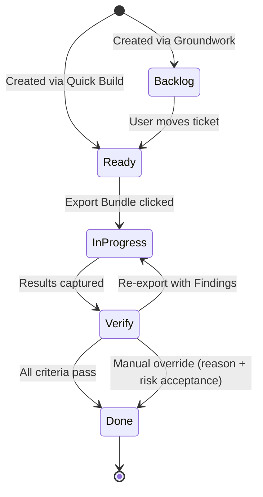
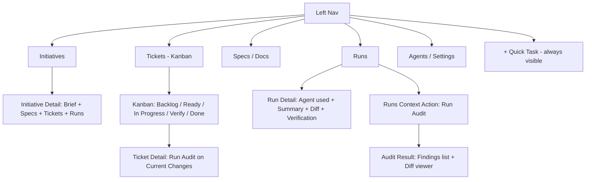

# Epic: Designing SpecFlow - A Spec-Driven Development Orchestrator

---

# Core Flows - SpecFlow

## Overview

SpecFlow has four named workflows. Each is a distinct user journey with a clear entry point, a set of user actions, and a defined exit state.

| Workflow | Purpose |
|---|---|
| **Groundwork** | Turn a raw idea into structured specs + an ordered ticket breakdown |
| **Milestone Run** | Execute tickets phase-by-phase with per-ticket verify gates |
| **Quick Build** | Plan and execute a single focused task without a full initiative |
| **Drift Audit** | Review an existing diff and produce structured findings + fix instructions |

---

## Workflow 1 - Groundwork

**Purpose:** Decompose a big idea into a structured initiative: specs, decisions, and an ordered, phase-grouped ticket backlog.

**Entry point:** "New Initiative" button in the Initiatives section of the left nav.

**Steps:**

1. User lands on a blank Initiative page. A large free-text area prompts: *"Describe what you want to build."*
2. User types a free-form description and clicks **Analyze**.
3. The Planner processes the description and renders a set of structured follow-up questions below the description (e.g., *"Who is the primary user?"*, *"What does success look like?"*, *"Are there constraints or non-goals?"*). Each question is a labeled input field.
4. User fills in the structured questions and clicks **Generate Specs**.
5. The Planner generates three documents, shown as tabs on the initiative page: **Brief**, **PRD**, and **Tech Spec**. Each is rendered as editable Markdown.
6. User reviews and edits any section inline. Changes are saved automatically.
7. User clicks **Generate Plan**. The Planner produces an ordered ticket breakdown, automatically grouped into suggested phases (e.g., *Phase 1 - Foundation*, *Phase 2 - Core Features*).
8. User reviews the phase/ticket list: can rename phases, reorder tickets within a phase, edit ticket titles and descriptions, or delete tickets.
9. User clicks **Create All Tickets**. Tickets are created in **Backlog** status, linked to the initiative. Phases are saved as grouping labels.
10. Initiative page now shows: Brief + specs tabs + phase-grouped ticket list + empty Runs section.

**Exit:** Initiative is live. All tickets are in Backlog. User proceeds to Milestone Run.

```wireframe
<!DOCTYPE html>
<html>
<head>
<style>
  * { box-sizing: border-box; margin: 0; padding: 0; font-family: sans-serif; font-size: 13px; }
  body { display: flex; height: 100vh; background: #f5f5f5; }
  .sidebar { width: 180px; background: #1a1a1a; color: #ccc; padding: 16px; flex-shrink: 0; }
  .sidebar .logo { color: #fff; font-weight: bold; font-size: 14px; margin-bottom: 24px; }
  .sidebar .nav-item { padding: 6px 8px; border-radius: 4px; margin-bottom: 2px; cursor: pointer; }
  .sidebar .nav-item.active { background: #333; color: #fff; }
  .main { flex: 1; overflow-y: auto; padding: 24px; }
  .page-title { font-size: 18px; font-weight: bold; margin-bottom: 4px; }
  .page-sub { color: #666; margin-bottom: 20px; }
  .card { background: #fff; border: 1px solid #ddd; border-radius: 6px; padding: 16px; margin-bottom: 16px; }
  .card-label { font-weight: 600; margin-bottom: 8px; color: #333; }
  textarea { width: 100%; border: 1px solid #ccc; border-radius: 4px; padding: 8px; resize: vertical; min-height: 80px; font-size: 13px; }
  .btn { display: inline-block; padding: 7px 14px; border-radius: 4px; border: 1px solid #ccc; background: #fff; cursor: pointer; font-size: 12px; }
  .btn-primary { background: #2563eb; color: #fff; border-color: #2563eb; }
  .questions { margin-top: 16px; }
  .q-item { margin-bottom: 12px; }
  .q-label { font-size: 12px; color: #555; margin-bottom: 4px; }
  input[type=text] { width: 100%; border: 1px solid #ccc; border-radius: 4px; padding: 6px 8px; font-size: 13px; }
  .section-divider { border-top: 1px solid #eee; margin: 16px 0; }
  .badge { display: inline-block; font-size: 11px; padding: 2px 7px; border-radius: 10px; background: #e0e7ff; color: #3730a3; margin-right: 4px; }
</style>
</head>
<body>
  <div class="sidebar">
    <div class="logo">SpecFlow</div>
    <div class="nav-item active">Initiatives</div>
    <div class="nav-item">Tickets</div>
    <div class="nav-item">Specs / Docs</div>
    <div class="nav-item">Runs</div>
    <div class="nav-item">Agents / Settings</div>
  </div>
  <div class="main">
    <div class="page-title">New Initiative</div>
    <div class="page-sub">Describe your idea - the Planner will ask follow-up questions before generating specs.</div>

    <div class="card">
      <div class="card-label">What do you want to build?</div>
      <textarea data-element-id="initiative-description">A user authentication system with email/password login, OAuth via GitHub, and a session management dashboard where users can revoke active sessions.</textarea>
      <div style="margin-top:10px; text-align:right;">
        <button class="btn btn-primary" data-element-id="analyze-btn">Analyze -></button>
      </div>
    </div>

    <div class="card">
      <div class="card-label">Follow-up Questions <span style="font-weight:normal; color:#888; font-size:11px;">- Answer these so the Planner can generate accurate specs</span></div>
      <div class="questions">
        <div class="q-item">
          <div class="q-label">Who is the primary user of this feature?</div>
          <input type="text" data-element-id="q1" value="End users of the SaaS app (not admins)" />
        </div>
        <div class="q-item">
          <div class="q-label">What does success look like for this initiative?</div>
          <input type="text" data-element-id="q2" value="Users can sign up, log in, and manage sessions without contacting support" />
        </div>
        <div class="q-item">
          <div class="q-label">Are there any constraints or non-goals?</div>
          <input type="text" data-element-id="q3" value="No SSO/SAML in v1; must work with existing Postgres schema" />
        </div>
        <div class="q-item">
          <div class="q-label">What's the target tech stack or environment?</div>
          <input type="text" data-element-id="q4" value="Node.js + Express + React + Postgres" />
        </div>
      </div>
      <div class="section-divider"></div>
      <div style="text-align:right;">
        <button class="btn" style="margin-right:8px;" data-element-id="skip-btn">Skip questions</button>
        <button class="btn btn-primary" data-element-id="generate-specs-btn">Generate Specs -></button>
      </div>
    </div>
  </div>
</body>
</html>
```

---

## Workflow 2 - Milestone Run

**Purpose:** Execute an initiative's tickets phase-by-phase, with a verify gate after each ticket before moving to the next.

**Entry point:** Initiative page (after Groundwork) or the Kanban board - user picks a ticket from Backlog or Ready.

**Steps:**

1. User opens a ticket from the Kanban board or the initiative's ticket list. Ticket page shows: description, acceptance criteria, implementation plan, suggested file targets, and a status checklist.
2. User moves the ticket to **Ready** (drag on Kanban or button on ticket page) when they're ready to act on it.
3. User clicks **Export Bundle**. A panel slides in asking: *"Which agent?"* - options are Claude Code, Codex CLI, OpenCode, Generic. User selects one.
4. The bundle is generated and displayed: a copy-to-clipboard button and a download link. The ticket moves to **In Progress**. If no git repo is detected, the export step requires selecting an **initial snapshot scope**; that baseline is captured immediately at export.
5. User runs the agent manually in their terminal (outside SpecFlow). SpecFlow waits.
6. User returns to the ticket page and clicks **Capture Results**.
7. The Capture panel shows:
   - If git is detected: an auto-generated diff preview with a *"Use this diff"* confirmation.
   - If git is not detected: current verification scope (captured at export) plus an optional **widen scope** action.
   - A text area: *"Summarize what the agent did (optional)."*
8. For no-git runs, widened scope is treated as **drift-only** context. Primary verification remains anchored to the initial export-time scope.
9. User confirms and clicks **Submit Results**. Verification runs automatically using git diff (when available) or snapshot comparison (when no git repo is present).
10. The **Verification Panel** appears below the ticket details: each acceptance criterion shows Pass or Fail. Drift flags (unexpected file touches, missing requirements, widened-scope drift warnings) are listed separately.
11. **If all pass:** ticket moves to **Done** automatically. User proceeds to the next ticket.
12. **If any fail:** ticket stays in **Verify** status. User gets two actions:
   - **Re-export with Findings** - generates a new bundle pre-loaded with failure context and fix instructions.
   - **Override to Done** - two-step safeguard: user enters a required reason, then confirms *"I accept risk"*; reason + confirmation are logged in run history.
13. Run history is grouped by ticket with expandable attempts, so retries remain auditable without clutter.
14. If an operation is recovered as `abandoned`, `superseded`, or `failed`, Runs and Ticket detail show a status badge with guided retry actions.
15. Phase guidance is soft. Users can start next-phase tickets early, but SpecFlow shows a warning badge (e.g., *"Starting Phase 2 before Phase 1 is complete"*).
16. When all tickets in a phase are Done, the phase collapses with a complete indicator.

**Exit:** All phases complete -> Initiative is marked Done.

```wireframe
<!DOCTYPE html>
<html>
<head>
<style>
  * { box-sizing: border-box; margin: 0; padding: 0; font-family: sans-serif; font-size: 13px; }
  body { display: flex; height: 100vh; background: #f5f5f5; }
  .sidebar { width: 180px; background: #1a1a1a; color: #ccc; padding: 16px; flex-shrink: 0; }
  .sidebar .logo { color: #fff; font-weight: bold; font-size: 14px; margin-bottom: 24px; }
  .sidebar .nav-item { padding: 6px 8px; border-radius: 4px; margin-bottom: 2px; }
  .sidebar .nav-item.active { background: #333; color: #fff; }
  .main { flex: 1; overflow-y: auto; padding: 24px; }
  .ticket-header { display: flex; align-items: center; gap: 10px; margin-bottom: 16px; }
  .ticket-title { font-size: 17px; font-weight: bold; }
  .status-badge { font-size: 11px; padding: 3px 9px; border-radius: 10px; background: #fef3c7; color: #92400e; border: 1px solid #fcd34d; }
  .status-badge.verify { background: #ede9fe; color: #5b21b6; border-color: #c4b5fd; }
  .status-badge.done { background: #d1fae5; color: #065f46; border-color: #6ee7b7; }
  .card { background: #fff; border: 1px solid #ddd; border-radius: 6px; padding: 14px; margin-bottom: 14px; }
  .card-label { font-weight: 600; margin-bottom: 10px; color: #333; font-size: 12px; text-transform: uppercase; letter-spacing: 0.04em; }
  .criteria-item { display: flex; align-items: flex-start; gap: 8px; padding: 6px 0; border-bottom: 1px solid #f0f0f0; }
  .criteria-item:last-child { border-bottom: none; }
  .pass { color: #16a34a; font-size: 14px; }
  .fail { color: #dc2626; font-size: 14px; }
  .drift-item { background: #fff7ed; border: 1px solid #fed7aa; border-radius: 4px; padding: 8px 10px; margin-bottom: 6px; font-size: 12px; color: #9a3412; }
  .btn { display: inline-block; padding: 7px 14px; border-radius: 4px; border: 1px solid #ccc; background: #fff; cursor: pointer; font-size: 12px; margin-right: 6px; }
  .btn-primary { background: #2563eb; color: #fff; border-color: #2563eb; }
  .btn-warn { background: #f59e0b; color: #fff; border-color: #f59e0b; }
  .diff-preview { background: #1e1e1e; color: #d4d4d4; border-radius: 4px; padding: 10px; font-family: monospace; font-size: 11px; line-height: 1.6; }
  .diff-add { color: #4ade80; }
  .diff-remove { color: #f87171; }
  .section-row { display: flex; gap: 14px; }
  .section-row .card { flex: 1; }
</style>
</head>
<body>
  <div class="sidebar">
    <div class="logo">SpecFlow</div>
    <div class="nav-item">Initiatives</div>
    <div class="nav-item active">Tickets</div>
    <div class="nav-item">Specs / Docs</div>
    <div class="nav-item">Runs</div>
    <div class="nav-item">Agents / Settings</div>
  </div>
  <div class="main">
    <div class="ticket-header">
      <div class="ticket-title">Implement GitHub OAuth callback handler</div>
      <div class="status-badge verify">Verify</div>
    </div>

    <div class="section-row">
      <div class="card">
        <div class="card-label">Acceptance Criteria</div>
        <div class="criteria-item"><span class="pass">PASS</span> OAuth callback route exists at /auth/github/callback</div>
        <div class="criteria-item"><span class="pass">PASS</span> User record is created or updated on first login</div>
        <div class="criteria-item"><span class="fail">FAIL</span> Session token is issued and stored in httpOnly cookie</div>
        <div class="criteria-item"><span class="pass">PASS</span> Redirect to dashboard on success</div>
      </div>
      <div class="card">
        <div class="card-label">Drift Flags</div>
        <div class="drift-item">Unexpected file touched: <strong>src/middleware/cors.ts</strong> - not in file targets</div>
        <div class="drift-item">Missing: session cookie logic not found in diff</div>
      </div>
    </div>

    <div class="card">
      <div class="card-label">Diff Preview</div>
      <div class="diff-preview">
        <div>--- a/src/routes/auth.ts</div>
        <div>+++ b/src/routes/auth.ts</div>
        <div class="diff-add">+ router.get('/auth/github/callback', async (req, res) => {</div>
        <div class="diff-add">+   const user = await handleGithubCallback(req.query.code);</div>
        <div class="diff-add">+   res.redirect('/dashboard');</div>
        <div class="diff-add">+ });</div>
      </div>
    </div>

    <div style="margin-top: 4px;">
      <button class="btn btn-warn" data-element-id="re-export-btn">Re-export with Findings</button>
      <button class="btn" data-element-id="override-done-btn">Override to Done</button>
    </div>
  </div>
</body>
</html>
```

---

## Workflow 3 - Quick Build

**Purpose:** Plan and execute a single focused task without going through a full initiative decomposition.

**Entry point:** The **Quick Task** button - a persistent `+` icon in the left nav sidebar, always visible regardless of current page.

**Steps:**

1. Clicking Quick Task opens a focused slide-in panel (not a full page). A single prompt: *"What do you need to build?"*
2. User types a brief description (1-3 sentences) and clicks **Plan It**.
3. The Planner triages task size/clarity:
   - If focused and bounded, it continues Quick Build.
   - If too large or ambiguous, SpecFlow auto-converts it into a **draft initiative** and routes the user into Groundwork with the original input prefilled.
4. For focused tasks, the Planner generates: acceptance criteria, a short implementation plan, and suggested file targets.
5. The panel expands to show the generated plan. User can edit acceptance criteria inline (add, remove, or reword items).
6. User clicks **Save as Task**. A ticket is created in **Ready** status (skips Backlog - it's already scoped). The panel closes and the board scrolls to the new ticket.
7. User opens the ticket and clicks **Export Bundle** - selects agent, bundle is generated.
8. User runs the agent manually, returns, and clicks **Capture Results** (same capture flow as Milestone Run).
9. Verification runs automatically. Ticket moves to Done or stays in Verify with findings.

**Notes:**
- Quick Tasks appear in the Kanban board without an initiative badge.
- A Quick Task can be linked to an existing initiative later via the ticket's detail page ("Link to Initiative" action).

```wireframe
<!DOCTYPE html>
<html>
<head>
<style>
  * { box-sizing: border-box; margin: 0; padding: 0; font-family: sans-serif; font-size: 13px; }
  body { display: flex; height: 100vh; background: #f5f5f5; }
  .sidebar { width: 180px; background: #1a1a1a; color: #ccc; padding: 16px; flex-shrink: 0; }
  .sidebar .logo { color: #fff; font-weight: bold; font-size: 14px; margin-bottom: 24px; }
  .sidebar .nav-item { padding: 6px 8px; border-radius: 4px; margin-bottom: 2px; }
  .sidebar .nav-item.active { background: #333; color: #fff; }
  .sidebar .quick-task-btn { margin-top: 16px; display: flex; align-items: center; gap: 6px; padding: 7px 8px; border-radius: 4px; background: #2563eb; color: #fff; cursor: pointer; font-size: 12px; font-weight: 600; }
  .overlay { position: fixed; top: 0; right: 0; width: 420px; height: 100vh; background: #fff; border-left: 1px solid #ddd; padding: 24px; box-shadow: -4px 0 16px rgba(0,0,0,0.08); z-index: 10; }
  .overlay-title { font-size: 15px; font-weight: bold; margin-bottom: 4px; }
  .overlay-sub { color: #666; margin-bottom: 16px; font-size: 12px; }
  textarea { width: 100%; border: 1px solid #ccc; border-radius: 4px; padding: 8px; resize: vertical; min-height: 70px; font-size: 13px; }
  .btn { display: inline-block; padding: 7px 14px; border-radius: 4px; border: 1px solid #ccc; background: #fff; cursor: pointer; font-size: 12px; margin-right: 6px; }
  .btn-primary { background: #2563eb; color: #fff; border-color: #2563eb; }
  .section-label { font-weight: 600; font-size: 11px; text-transform: uppercase; letter-spacing: 0.04em; color: #555; margin: 14px 0 8px; }
  .criteria-row { display: flex; align-items: center; gap: 6px; padding: 5px 0; border-bottom: 1px solid #f0f0f0; }
  .criteria-row:last-child { border-bottom: none; }
  .criteria-text { flex: 1; color: #333; }
  .remove-btn { color: #aaa; cursor: pointer; font-size: 14px; }
  .add-link { color: #2563eb; font-size: 12px; cursor: pointer; margin-top: 6px; display: inline-block; }
  .plan-box { background: #f8f8f8; border: 1px solid #e5e5e5; border-radius: 4px; padding: 10px; font-size: 12px; color: #444; line-height: 1.6; }
  .file-tag { display: inline-block; background: #f0f0f0; border-radius: 3px; padding: 2px 6px; font-size: 11px; margin: 2px; font-family: monospace; }
</style>
</head>
<body>
  <div class="sidebar">
    <div class="logo">SpecFlow</div>
    <div class="nav-item active">Initiatives</div>
    <div class="nav-item">Tickets</div>
    <div class="nav-item">Specs / Docs</div>
    <div class="nav-item">Runs</div>
    <div class="nav-item">Agents / Settings</div>
    <div class="quick-task-btn" data-element-id="quick-task-nav-btn">+ Quick Task</div>
  </div>

  <div class="overlay">
    <div class="overlay-title">Quick Task</div>
    <div class="overlay-sub">Describe the task - the Planner will generate a plan immediately, no follow-up questions.</div>
    <textarea data-element-id="quick-task-input">Add a rate limiter to the /auth/login endpoint - max 5 attempts per IP per minute, return 429 with a Retry-After header.</textarea>
    <div style="margin-top:10px; text-align:right;">
      <button class="btn btn-primary" data-element-id="plan-it-btn">Plan It -></button>
    </div>

    <div class="section-label">Acceptance Criteria</div>
    <div class="criteria-row"><span class="criteria-text">Rate limiter applied to POST /auth/login</span><span class="remove-btn">x</span></div>
    <div class="criteria-row"><span class="criteria-text">Returns 429 when limit exceeded</span><span class="remove-btn">x</span></div>
    <div class="criteria-row"><span class="criteria-text">Retry-After header included in 429 response</span><span class="remove-btn">x</span></div>
    <div class="criteria-row"><span class="criteria-text">Limit resets after 60 seconds per IP</span><span class="remove-btn">x</span></div>
    <span class="add-link" data-element-id="add-criteria-link">+ Add criterion</span>

    <div class="section-label">Implementation Plan</div>
    <div class="plan-box">Install or use existing rate-limit middleware. Configure per-IP window of 60s with max 5 hits. Apply middleware specifically to the login route. Return 429 with Retry-After on breach.</div>

    <div class="section-label">File Targets</div>
    <div>
      <span class="file-tag">src/routes/auth.ts</span>
      <span class="file-tag">src/middleware/rateLimiter.ts</span>
    </div>

    <div style="margin-top: 16px; display:flex; justify-content:flex-end; gap:8px;">
      <button class="btn" data-element-id="cancel-btn">Cancel</button>
      <button class="btn btn-primary" data-element-id="save-task-btn">Save as Task -></button>
    </div>
  </div>
</body>
</html>
```

---

## Workflow 4 - Drift Audit

**Purpose:** Point SpecFlow at an existing diff or branch and receive structured findings - categorized issues, severity ratings, and actionable fix instructions.

**Entry points:**
- **Runs page:** user clicks **Run Audit** as a contextual action.
- **Ticket page:** user clicks **Run Audit on Current Changes** as a contextual action.
- No separate `specflow audit` CLI command in v1.

**Steps:**

1. User triggers audit from either Runs or a Ticket page contextual action.
2. User selects a diff source from a segmented control: **Current git diff** / **Git branch** / **Commit range** / **File snapshot**.
3. When launched from a Ticket page, default scope is prefilled to **ticket file targets + currently changed files** (user can adjust before running).
4. (Optional) User links the audit to an existing initiative or ticket using a search-as-you-type field. Linking provides acceptance criteria as additional context for the Verifier.
5. If no git repo is present, user selects folders/files for snapshot comparison scope before running the audit.
6. User clicks **Run Audit**. The Verifier analyzes the diff against: linked ticket's acceptance criteria (if linked) + repo conventions from the `AGENTS.md`-style instruction file.
7. Findings are displayed in a two-panel layout:
   - **Left:** Categorized findings list - each item shows category (Missing Requirement / Convention Violation / Unexpected Change / Suggestion), severity badge (Error / Warning / Info), a short description, and the affected file.
   - **Right:** Unified diff viewer with finding markers in the gutter - clicking a marker highlights the corresponding finding on the left.
8. For each finding, the user can:
   - **Create Ticket** - opens a pre-filled Quick Task panel with the finding as the task description.
   - **Export Fix Bundle (Quick Fix)** - generates an agent bundle targeting only that finding while writing linkage metadata to the run attempt (source run + finding ID).
   - **Dismiss** - marks the finding as acknowledged (with an optional note).
9. The completed audit is saved to the **Runs** section with a timestamp, diff source label, finding count, linked ticket (if any), and any dismissal notes.
10. If audit generation or staged commit recovery lands in `abandoned`, `superseded`, or `failed`, Runs shows explicit status badges and guided retry actions.

```wireframe
<!DOCTYPE html>
<html>
<head>
<style>
  * { box-sizing: border-box; margin: 0; padding: 0; font-family: sans-serif; font-size: 13px; }
  body { display: flex; height: 100vh; background: #f5f5f5; }
  .sidebar { width: 180px; background: #1a1a1a; color: #ccc; padding: 16px; flex-shrink: 0; }
  .sidebar .logo { color: #fff; font-weight: bold; font-size: 14px; margin-bottom: 24px; }
  .sidebar .nav-item { padding: 6px 8px; border-radius: 4px; margin-bottom: 2px; }
  .sidebar .nav-item.active { background: #333; color: #fff; }
  .main { flex: 1; display: flex; flex-direction: column; overflow: hidden; }
  .top-bar { padding: 16px 20px; border-bottom: 1px solid #ddd; background: #fff; display: flex; align-items: center; gap: 12px; }
  .top-bar-title { font-size: 15px; font-weight: bold; flex: 1; }
  .seg-control { display: flex; border: 1px solid #ccc; border-radius: 4px; overflow: hidden; }
  .seg-btn { padding: 5px 10px; background: #fff; border-right: 1px solid #ccc; cursor: pointer; font-size: 11px; }
  .seg-btn:last-child { border-right: none; }
  .seg-btn.active { background: #2563eb; color: #fff; }
  .btn { display: inline-block; padding: 6px 12px; border-radius: 4px; border: 1px solid #ccc; background: #fff; cursor: pointer; font-size: 12px; }
  .btn-primary { background: #2563eb; color: #fff; border-color: #2563eb; }
  .content { flex: 1; display: flex; overflow: hidden; }
  .findings-panel { width: 340px; border-right: 1px solid #ddd; overflow-y: auto; background: #fff; }
  .findings-header { padding: 12px 14px; border-bottom: 1px solid #eee; font-weight: 600; font-size: 12px; color: #555; }
  .finding-item { padding: 10px 14px; border-bottom: 1px solid #f0f0f0; cursor: pointer; }
  .finding-item:hover { background: #f8f8f8; }
  .finding-item.selected { background: #eff6ff; border-left: 3px solid #2563eb; }
  .finding-top { display: flex; align-items: center; gap: 6px; margin-bottom: 4px; }
  .badge { font-size: 10px; padding: 2px 6px; border-radius: 3px; font-weight: 600; }
  .badge-error { background: #fee2e2; color: #991b1b; }
  .badge-warn { background: #fef3c7; color: #92400e; }
  .badge-info { background: #e0f2fe; color: #0369a1; }
  .finding-desc { font-size: 12px; color: #333; margin-bottom: 4px; }
  .finding-file { font-size: 11px; color: #888; font-family: monospace; }
  .finding-actions { display: flex; gap: 6px; margin-top: 6px; }
  .action-link { font-size: 11px; color: #2563eb; cursor: pointer; }
  .diff-panel { flex: 1; overflow-y: auto; background: #1e1e1e; padding: 14px; font-family: monospace; font-size: 11px; line-height: 1.7; color: #d4d4d4; }
  .diff-file { color: #9cdcfe; margin-bottom: 6px; margin-top: 12px; }
  .diff-add { color: #4ade80; }
  .diff-remove { color: #f87171; }
  .diff-marker { display: inline-block; background: #f59e0b; color: #000; border-radius: 2px; padding: 0 4px; font-size: 10px; margin-right: 4px; cursor: pointer; }
</style>
</head>
<body>
  <div class="sidebar">
    <div class="logo">SpecFlow</div>
    <div class="nav-item">Initiatives</div>
    <div class="nav-item">Tickets</div>
    <div class="nav-item">Specs / Docs</div>
    <div class="nav-item active">Runs</div>
    <div class="nav-item">Agents / Settings</div>
  </div>
  <div class="main">
    <div class="top-bar">
      <div class="top-bar-title">Drift Audit - feature/auth-oauth</div>
      <div class="seg-control">
        <div class="seg-btn">Current diff</div>
        <div class="seg-btn active">Git branch</div>
        <div class="seg-btn">Commit range</div>
        <div class="seg-btn">Snapshot</div>
      </div>
      <button class="btn btn-primary" data-element-id="run-audit-btn">Run Audit</button>
    </div>
    <div class="content">
      <div class="findings-panel">
        <div class="findings-header">4 Findings - linked to: Implement GitHub OAuth</div>

        <div class="finding-item selected" data-element-id="finding-1">
          <div class="finding-top"><span class="badge badge-error">Error</span><span style="font-size:11px;color:#555;">Missing Requirement</span></div>
          <div class="finding-desc">Session cookie not set after OAuth callback - acceptance criterion unmet</div>
          <div class="finding-file">src/routes/auth.ts:42</div>
          <div class="finding-actions">
            <span class="action-link" data-element-id="create-ticket-1">Create Ticket</span>
            <span class="action-link" data-element-id="export-fix-1">Export Fix Bundle</span>
            <span class="action-link" data-element-id="dismiss-1">Dismiss</span>
          </div>
        </div>

        <div class="finding-item" data-element-id="finding-2">
          <div class="finding-top"><span class="badge badge-warn">Warning</span><span style="font-size:11px;color:#555;">Unexpected Change</span></div>
          <div class="finding-desc">cors.ts modified - not listed in file targets for this ticket</div>
          <div class="finding-file">src/middleware/cors.ts:8</div>
          <div class="finding-actions">
            <span class="action-link">Create Ticket</span>
            <span class="action-link">Export Fix Bundle</span>
            <span class="action-link">Dismiss</span>
          </div>
        </div>

        <div class="finding-item" data-element-id="finding-3">
          <div class="finding-top"><span class="badge badge-warn">Warning</span><span style="font-size:11px;color:#555;">Convention Violation</span></div>
          <div class="finding-desc">Error not wrapped in AppError class - violates AGENTS.md error handling convention</div>
          <div class="finding-file">src/routes/auth.ts:67</div>
          <div class="finding-actions">
            <span class="action-link">Create Ticket</span>
            <span class="action-link">Export Fix Bundle</span>
            <span class="action-link">Dismiss</span>
          </div>
        </div>

        <div class="finding-item" data-element-id="finding-4">
          <div class="finding-top"><span class="badge badge-info">Info</span><span style="font-size:11px;color:#555;">Suggestion</span></div>
          <div class="finding-desc">Consider extracting OAuth user-upsert logic into a service layer</div>
          <div class="finding-file">src/routes/auth.ts:55</div>
          <div class="finding-actions">
            <span class="action-link">Create Ticket</span>
            <span class="action-link">Dismiss</span>
          </div>
        </div>
      </div>

      <div class="diff-panel">
        <div class="diff-file">--- a/src/routes/auth.ts +++ b/src/routes/auth.ts</div>
        <div>@@ -38,6 +38,14 @@</div>
        <div class="diff-add">+ router.get('/auth/github/callback', async (req, res) => {</div>
        <div class="diff-add">+   const { code } = req.query;</div>
        <div class="diff-add">+   const user = await githubOAuth.exchange(code);</div>
        <div class="diff-add">+   await upsertUser(user);</div>
        <div><span class="diff-marker" data-element-id="marker-1">F1</span><span class="diff-add">+   // TODO: set session cookie</span></div>
        <div class="diff-add">+   res.redirect('/dashboard');</div>
        <div class="diff-add">+ });</div>
        <div style="margin-top:10px;" class="diff-file">--- a/src/middleware/cors.ts +++ b/src/middleware/cors.ts</div>
        <div><span class="diff-marker" data-element-id="marker-2">F2</span><span class="diff-remove">- origin: 'http://localhost:3000'</span></div>
        <div class="diff-add">+ origin: process.env.ALLOWED_ORIGIN</div>
      </div>
    </div>
  </div>
</body>
</html>
```

---

## Ticket Lifecycle (State Machine)



---

## Board Navigation Structure


