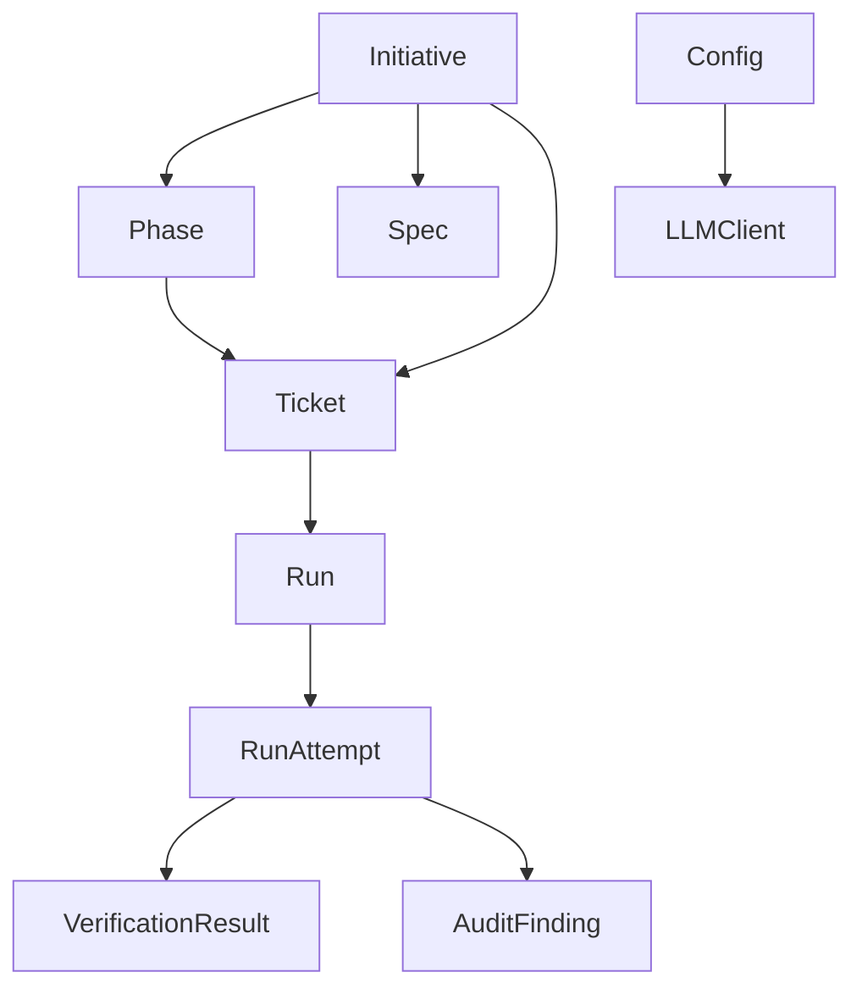
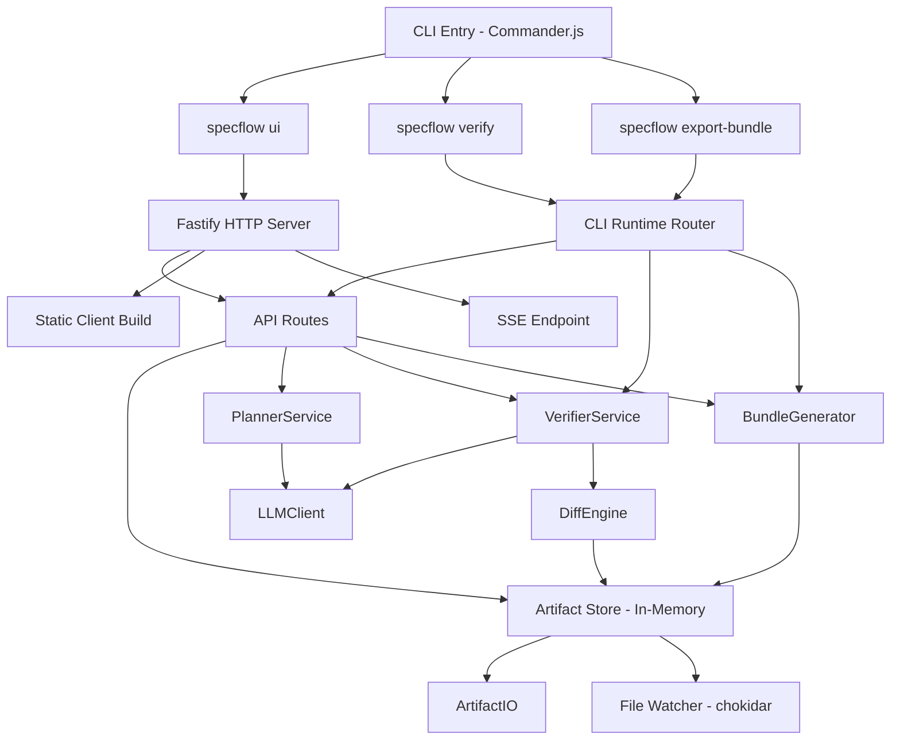
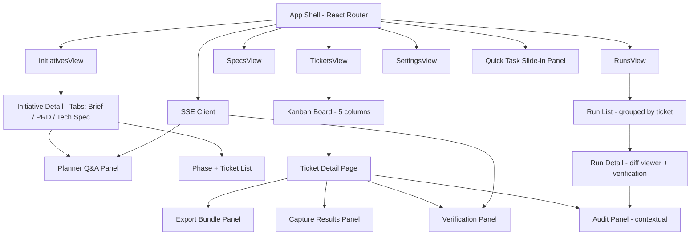
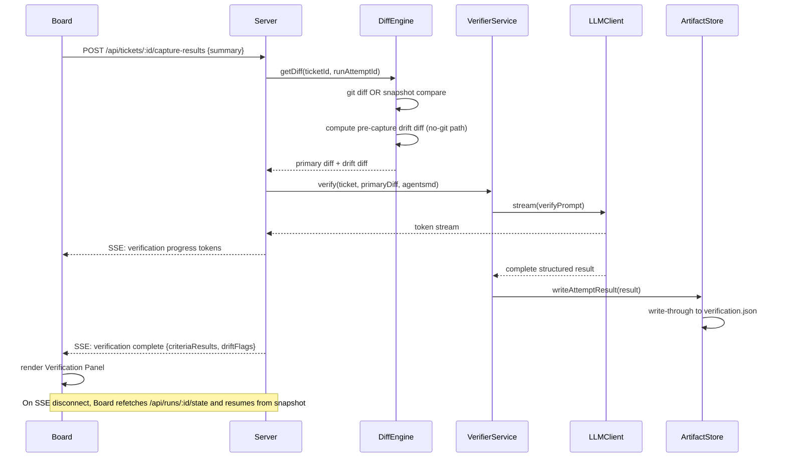
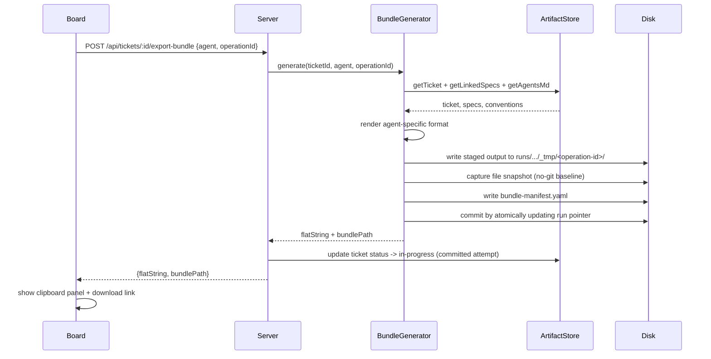

# Epic: Designing SpecFlow - A Spec-Driven Development Orchestrator

---

# Tech Plan - SpecFlow

## Architectural Approach

### Package Structure

Two packages sharing a single `package.json` workspace root:

| Package | Contents | Runtime |
|---|---|---|
| `packages/app` | Fastify server, CLI entry points, all core services | Node.js |
| `packages/client` | React + Vite SPA | Browser |

The server builds the client SPA and serves it as static files. There is no separate deployment step - `specflow ui` starts one process that serves everything. Shared TypeScript types (artifact schemas, API contracts) live in `packages/app/src/types/` and are imported by both packages during development via path aliases.

**Rationale:** Two packages keeps the browser/Node.js boundary explicit without the overhead of a full four-package monorepo. The CLI and server share all core logic directly - no inter-process communication needed.

### In-Memory Artifact Store

On server startup, the store scans `specflow/` and loads all artifacts into typed in-memory maps (initiatives, tickets, runs, specs, config). All board API reads are served from memory - no filesystem I/O per request. Mutations follow a **staged commit model**:

1. Build full operation output in a temp attempt directory (bundle files, snapshot, diff, verification output).
2. Validate integrity and write a temp manifest.
3. Atomically commit by updating the authoritative pointer/manifest in `run.yaml`.
4. Refresh in-memory maps from committed files.

A file watcher (chokidar) detects external edits and reloads affected artifacts into memory.

**Failure mode handling:** single-file writes use `.tmp` + atomic rename. Multi-file operations are never considered committed until the final pointer/manifest update succeeds. On startup, orphan temp attempt directories are detected and marked as recoverable leftovers, preventing partial state from appearing as committed history.

Staged-commit edge-case rules:
- Writes are serialized with a per-run lock; concurrent operations against the same run are rejected with retryable conflict.
- Each staged operation has `operationLeaseExpiresAt`; expired operations are treated as abandoned.
- Recovery on startup:
  - `activeOperationId` present + committed pointer missing + tmp exists -> mark operation `abandoned`, keep artifacts for inspection.
  - `activeOperationId` present + committed pointer already advanced -> mark operation `superseded`, clear active pointer.
  - tmp missing but active pointer present -> mark operation `failed` and clear active pointer.
- Cleanup policy: abandoned/superseded temp directories are retained for a bounded TTL, then pruned by background cleanup.

### CLI as Thin Wrapper

`specflow ui` starts the Fastify server and opens the browser. `specflow verify` and `specflow export-bundle` use a **prefer-server** execution strategy:

- If server is running, CLI delegates mutating operations to server APIs (server-authoritative write path).
- If server is not running, CLI executes locally in-process using the same service layer.

Edge-case rules for delegation:
- CLI probes `/api/runtime/status` and checks capability + protocol version before delegating.
- If server is reachable but capability/protocol check fails, mutating commands **fail closed** (no local fallback) to avoid split-brain writes.
- Delegated mutating requests include `operationId` (idempotency key). If CLI times out, it queries operation state before retrying.
- Retry behavior is idempotent: repeated requests with same `operationId` must return the same terminal outcome.

This avoids concurrent-writer corruption between server in-memory state and standalone CLI mutations while preserving offline CLI usability.

### LLM Calls Through Server Only

The browser never calls the LLM API directly. All AI operations (Planner, Verifier) go through Fastify API routes. The server reads provider API keys from `.env` (`OPENROUTER_API_KEY`, `OPENAI_API_KEY`, `ANTHROPIC_API_KEY`) and keeps those keys out of client payloads. Responses stream back to the client via Server-Sent Events (SSE).

SSE reconnection is **non-resumable with snapshot refresh**:
- On disconnect, client reconnects and immediately fetches latest planner/run state via REST.
- UI resumes from current persisted state (no event replay buffer contract in v1).

This keeps the API key off the network and out of the browser while keeping reconnection semantics simple and explicit.

### Bundle Duality

`specflow export-bundle` writes a **directory bundle** to `specflow/runs/<run-id>/attempts/<attempt-id>/bundle/`. The board's Export Bundle panel calls an API endpoint that returns the same content as a **flattened clipboard string**. Both are generated by the same Bundle Generator service.

Bundle contracts are versioned:
- Every bundle includes a manifest with `bundleSchemaVersion`, `agentTarget`, and `exportMode` (standard vs quick-fix).
- Quick-fix exports include source linkage metadata (`sourceRunId`, `sourceFindingId`) for audit traceability.
- Agent renderers (Claude Code / Codex CLI / OpenCode / Generic) are validated by golden tests against fixed fixtures.

This prevents silent format drift across agent targets.

### Verification Strategy

The Diff Engine checks for a git repo first (`git rev-parse --is-inside-work-tree`). If found, uses `git diff` for the current working tree. If not, uses the file snapshot captured at Export Bundle time (stored in the run attempt record, scoped to ticket file targets + user-selected folders).

No-git verification uses a **two-stage scope + dual-diff model**:
- **Initial scope** is selected and baselined at export.
- **Capture-time widening** is allowed, but widened files are drift-only context.
- **Primary diff:** baseline-at-export vs capture-time state for the initial scope (used for verification).
- **Drift diff:** pre-capture local changes and widened-scope deltas surfaced as warnings.

The Verifier LLM receives the primary diff, acceptance criteria, and `specflow/AGENTS.md` and returns structured pass/fail results. Drift diff warnings are shown alongside verification output for operator awareness.

### Local-Only Binding

Fastify binds to `127.0.0.1` by default. `specflow ui --host 0.0.0.0` enables LAN exposure. No external network calls except to the configured LLM provider.

---

## Data Model

### File Layout

```text
specflow/
  config.yaml                        # provider, model, host, port, repoInstructionFile (non-secret)
  AGENTS.md                          # repo instruction file (conventions)
  initiatives/
    <id>/
      initiative.yaml                # metadata, status, phase list
      brief.md
      prd.md
      tech-spec.md
  tickets/
    <id>.yaml                        # all ticket fields
  runs/
    <id>/
      run.yaml                       # run metadata, committed attempt pointer
      attempts/
        <attempt-id>/
          bundle/                    # directory bundle (CLI)
            PROMPT.md
            AGENTS.md
            <referenced-spec-files>
          bundle-flat.md             # flattened clipboard version
          bundle-manifest.yaml       # versioned contract metadata
          snapshot-before/           # no-git baseline (file targets only)
          diff-primary.patch         # verification diff
          diff-drift.patch           # pre-capture local drift warning diff
          verification.json          # structured pass/fail results
      _tmp/
        <operation-id>/              # staged commit workspace (not yet committed)
          operation-manifest.yaml    # operation state + lease + validation
          ...
  decisions/
    <id>.md
```

### Core Entities

**Initiative**
```yaml
id: string
title: string
description: string          # original free-text input
status: draft | active | done
phases:
  - id: string
    name: string
    order: number
    status: active | complete
specIds: string[]
ticketIds: string[]
createdAt: ISO8601
updatedAt: ISO8601
```

**Ticket**
```yaml
id: string
initiativeId: string | null  # null for Quick Tasks
phaseId: string | null
title: string
description: string
status: backlog | ready | in-progress | verify | done
acceptanceCriteria:
  - id: string
    text: string
implementationPlan: string   # Markdown
fileTargets: string[]        # relative paths
runId: string | null         # current active run
createdAt: ISO8601
updatedAt: ISO8601
```

**Run + RunAttempt**
```yaml
# run.yaml
id: string
ticketId: string | null      # null for standalone audits
type: execution | audit
agentType: claude-code | codex-cli | opencode | generic
status: pending | complete
attempts: string[]           # ordered attempt IDs
committedAttemptId: string | null
activeOperationId: string | null    # non-null only during staged commit
operationLeaseExpiresAt: ISO8601 | null
lastCommittedAt: ISO8601 | null
createdAt: ISO8601

# attempts/<id>/verification.json
attemptId: string
agentSummary: string
diffSource: git | snapshot
initialScopePaths: string[]
widenedScopePaths: string[]
primaryDiffPath: string
driftDiffPath: string | null
overrideReason: string | null
overrideAccepted: boolean
criteriaResults:
  - criterionId: string
    pass: boolean
    evidence: string
driftFlags:
  - type: unexpected-file | missing-requirement | pre-capture-drift | widened-scope-drift
    file: string
    description: string
overallPass: boolean
createdAt: ISO8601
```

**AuditFinding** (within `verification.json` for audit-type runs)
```yaml
findings:
  - id: string
    category: missing-requirement | convention-violation | unexpected-change | suggestion
    severity: error | warning | info
    description: string
    file: string
    line: number | null
    dismissed: boolean
    dismissNote: string | null
    ticketCreated: string | null   # ticket ID if converted
```

**Config**
```yaml
provider: anthropic | openai | openrouter
model: string                # e.g. claude-opus-4-5, gpt-4o, openrouter/auto
apiKey?: string              # optional legacy fallback; prefer environment variables
port: number                 # default 3141
host: string                 # default 127.0.0.1
repoInstructionFile: string  # default specflow/AGENTS.md
```

**BundleManifest**
```yaml
bundleSchemaVersion: string      # e.g. 1.0.0
rendererVersion: string          # agent renderer implementation version
agentTarget: claude-code | codex-cli | opencode | generic
exportMode: standard | quick-fix
ticketId: string | null
runId: string
attemptId: string
sourceRunId: string | null       # present for quick-fix from audit findings
sourceFindingId: string | null   # present for quick-fix from audit findings
contextFiles: string[]
requiredFiles: string[]
contentDigest: string            # checksum of rendered bundle payload
generatedAt: ISO8601
```

**OperationManifest**
```yaml
operationId: string
runId: string
attemptId: string
state: prepared | committed | abandoned | superseded | failed
leaseExpiresAt: ISO8601
validationPassed: boolean
error: string | null
createdAt: ISO8601
updatedAt: ISO8601
```

### Entity Relationships



---

## Component Architecture

### packages/app - Server + CLI



**Component responsibilities:**

| Component | Responsibility |
|---|---|
| **CLI Entry** | Parses commands; delegates mutating commands to running server when available; fail-closed on protocol mismatch; local fallback only when server absent |
| **Fastify Server** | HTTP + SSE, serves static client build, mounts API routes |
| **API Routes** | REST endpoints for all CRUD + action operations; streams SSE for LLM jobs |
| **Artifact Store** | Typed in-memory maps; staged commit orchestrator; chokidar reload on external edits |
| **Artifact IO** | Reads/writes YAML + Markdown; enforces `specflow/` directory layout; atomic writes via temp-rename |
| **Planner Service** | Assembles prompts per job type (clarify, spec-gen, plan, triage); parses structured LLM responses |
| **Verifier Service** | Assembles primary diff + drift diff + criteria + AGENTS.md; parses pass/fail + drift warnings |
| **Diff Engine** | Git diff via `simple-git`; file snapshot diff via `diff` library; snapshot capture at export time |
| **Bundle Generator** | Assembles context; renders per-agent formats; emits versioned bundle manifest; supports quick-fix export linkage metadata; validated by golden tests |
| **LLM Client** | Single provider adapter (Anthropic/OpenAI/OpenRouter); handles streaming; resolves API keys from `.env` (with optional legacy config fallback) |

**Key API surface (representative):**

| Method | Path | Description |
|---|---|---|
| `GET` | `/api/runtime/status` | Server health + capability probe (used by CLI for prefer-server delegation) |
| `GET` | `/api/operations/:id` | Operation state probe for idempotent retry after timeout |
| `POST` | `/api/initiatives` | Create initiative, trigger Planner clarify |
| `POST` | `/api/initiatives/:id/generate-specs` | Generate Brief/PRD/Tech Spec |
| `POST` | `/api/initiatives/:id/generate-plan` | Generate phase + ticket breakdown |
| `POST` | `/api/tickets` | Create ticket (Quick Build or Groundwork) |
| `POST` | `/api/tickets/:id/export-bundle` | Generate bundle; returns flat string + writes directory |
| `POST` | `/api/tickets/:id/capture-results` | Submit diff/summary; triggers verification |
| `GET` | `/api/tickets/:id/verify/stream` | SSE stream for verification progress |
| `GET` | `/api/runs` | List runs with ticket/status/agent/date filters |
| `GET` | `/api/runs/:id` | Get run detail with committed artifacts and diffs |
| `GET` | `/api/runs/:id/state` | Snapshot endpoint for SSE reconnect recovery |
| `POST` | `/api/runs/:id/audit` | Run Drift Audit on a diff source |
| `POST` | `/api/runs/:id/findings/:findingId/export-fix-bundle` | Generate quick-fix bundle with source linkage metadata |
| `POST` | `/api/runs/:id/findings/:findingId/create-ticket` | Create a follow-up ticket from an audit finding |
| `POST` | `/api/runs/:id/findings/:findingId/dismiss` | Dismiss finding with required note |
| `POST` | `/api/tickets/:id/capture-preview` | Preview verification diff/scope before capture |
| `GET` | `/api/runs/:runId/attempts/:attemptId/bundle.zip` | Download run attempt bundle as zip |
| `GET` | `/api/planner/stream` | SSE stream for Planner LLM output |
| `GET` | `/api/artifacts` | Full in-memory state dump for initial board load |

### packages/client - React SPA



**Component responsibilities:**

| Component | Responsibility |
|---|---|
| **App Shell** | Layout, left nav, routing, Quick Task panel trigger |
| **SSE Client** | Maintains SSE connections; on disconnect performs snapshot refresh via REST and resumes from latest persisted state |
| **Planner Q&A Panel** | Renders structured follow-up questions; submits answers; streams spec generation output |
| **Kanban Board** | Five-column drag-and-drop ticket view; phase warning badges; initiative badge on tickets |
| **Export Bundle Panel** | Agent selector; displays flattened clipboard string; copy button; download link for directory bundle |
| **Capture Results Panel** | Git diff preview (if git detected) or folder/file picker (no-git); optional summary text area |
| **Verification Panel** | Per-criterion pass/fail; drift flags; Re-export button; two-step Override to Done flow |
| **Audit Panel** | Diff source selector; two-panel findings list + diff viewer with gutter markers; per-finding actions |
| **Run List** | Grouped by ticket with expandable attempts; shows operation status badges (`abandoned`/`superseded`/`failed`) with guided retry actions |
| **Ticket Detail Status Banner** | Mirrors operation status badges and exposes retry/recover actions relevant to the active run |
| **Diff Viewer** | Plain unified diff renderer; gutter markers linked to findings |

### End-to-End Request Trace: Verification



### End-to-End Request Trace: Export Bundle


