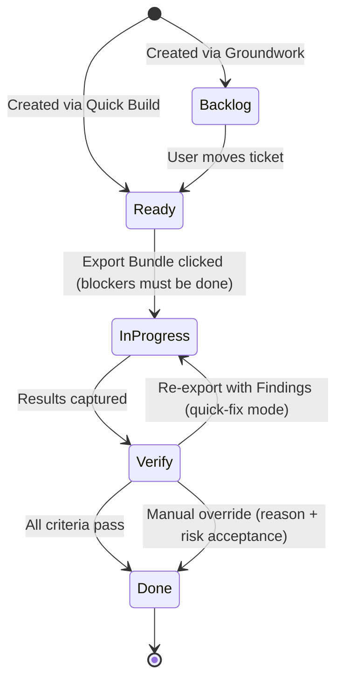
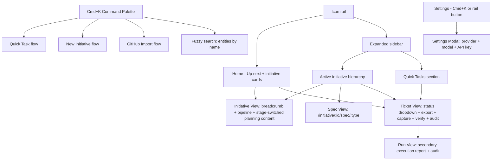

# Workflows - SpecFlow

SpecFlow has four named workflows. Each is a distinct user journey with a clear entry point, a set of user actions, and a defined exit state.

Related docs:

- For setup and command entry points, see [`../README.md`](../README.md)
- For desktop-first versus legacy web runtime behavior, see [`runtime-modes.md`](runtime-modes.md)
- For implementation architecture behind these flows, see [`architecture.md`](architecture.md)
- For canonical product and UI wording, see [`product-language-spec.md`](product-language-spec.md)

| Workflow | Purpose |
|---|---|
| **Groundwork** | Turn a raw idea into structured specs + an ordered ticket breakdown |
| **Milestone Run** | Execute tickets phase-by-phase with per-ticket verify gates |
| **Quick Build** | Plan and execute a single focused task without a full initiative |
| **Drift Audit** | Review an existing diff and produce structured findings + fix instructions |

---

## Workflow 1 - Groundwork

**Purpose:** Decompose a big idea into a structured initiative: specs, review gates, decisions, and an ordered, phase-grouped ticket backlog.

**Entry point:** Press **Cmd+K** and select **New Initiative**, or click **Start new initiative** from Home.

**Steps:**

1. User lands in the same planning shell they will use for the full journey. A persistent initiative pipeline stays visible across Home, creation, planning, ticket, and run surfaces.
2. User types a free-form idea and continues directly into **Brief intake** in the same screen. The idea card stays visible above the intake so the user does not lose context during the handoff.
3. Fresh initiatives always begin with **Brief intake**. SpecFlow asks a required four-question consultation before the first brief can be generated. The questions lock the primary problem, primary user, success criteria, and hard constraints or platform assumptions.
4. Once the intake is answered or explicitly deferred, the user generates the Brief. SpecFlow then runs a **Brief review** checkpoint.
5. User moves into **Core flows**. If needed, the planner asks a few phase-specific blocker questions about journeys, screens, or states. The user then generates the Core flows artifact and resolves the **Review core flows** plus **Cross-check brief and core flows** checkpoint.
6. User moves into **PRD**. If needed, the planner asks a few product-behavior blocker questions, then the user generates the PRD and resolves **Review PRD** plus **Cross-check core flows and PRD**.
7. User moves into **Tech spec**. If needed, the planner asks a few implementation blocker questions, then the user generates the Tech spec and resolves **Review tech spec**, **Cross-check PRD and tech spec**, and the **spec-set review**.
8. User moves into **Tickets** and generates the ticket plan. The Planner scans the repo (file tree + key config files) to ground the plan in the actual codebase, then produces an ordered ticket breakdown grouped into suggested phases plus an explicit spec-to-ticket coverage ledger.
9. After ticket generation, SpecFlow runs a **Coverage checkpoint**. If the ticket plan leaves important flows, requirements, or decisions uncovered, the user must rerun or override that check before execution starts.
10. The initiative shell keeps each step in one visible stage: **Consult**, **Draft**, **Checkpoint**, or **Complete**. Generated artifacts default to a focused summary, while full document views and review findings stay behind secondary actions instead of flooding the main page.
11. The top-level workspace stays light by default: a collapsed icon rail for primary navigation, Up next on Home, and an in-place expandable sidebar that reveals initiative structure without opening a second panel.

**Exit:** Initiative is ready for execution once the coverage checkpoint is passed or overridden. All tickets are in Backlog. User proceeds to Milestone Run.

---

## Workflow 2 - Milestone Run

**Purpose:** Execute an initiative's tickets phase-by-phase, with a verify gate after each ticket before moving to the next.

**Entry point:** Initiative page (after Groundwork), Home's Up next queue, or the expanded left sidebar.

**Steps:**

1. User opens a ticket from an initiative, the Home queue, or the expanded left sidebar. The ticket view opens as a single execution workspace with a **Preflight** card first, then one execution timeline below.
2. If the ticket is still in **Backlog**, the user can move it to **Ready** via the status dropdown. When they try to move it into **In Progress**, the server rejects the change with a 409 error if the ticket still has unfinished blockers or the initiative's **Coverage check** is blocked or stale.
3. User clicks **Create bundle**. The execution section asks which agent should receive the handoff bundle: Claude Code, Codex CLI, OpenCode, or Generic. For initiative-linked tickets, unresolved coverage checks also block export until the user resolves or overrides the check in the initiative view.
4. The bundle is generated and displayed inline. The user can copy the flattened bundle immediately. Desktop mode also offers a native **Save ZIP bundle** action, while legacy web mode keeps the HTTP ZIP download path. The ticket moves to **In Progress**. If no git repo is detected, the export step captures an initial file snapshot at the selected scope as the baseline.
5. User runs the agent manually in their terminal (outside SpecFlow). SpecFlow waits.
6. User returns to the ticket page and opens the verification section.
7. The Capture panel shows:
   - If git is detected: an auto-generated diff preview with a *"Use this diff"* confirmation.
   - If git is not detected: current verification scope (captured at export) plus an optional **widen scope** action.
   - A text area: *"Summarize what the agent did (optional)."*
8. For no-git runs, widened scope is treated as **drift-only** context. Primary verification remains anchored to the initial export-time scope.
9. User clicks **Verify work**. Verification runs automatically.
10. The **Verification Panel** appears below the ticket details: each acceptance criterion shows Pass or Fail, a **severity** (Critical/Major/Minor/Outdated), and a **remediation hint** on failure. Drift flags (unexpected file touches, missing requirements, widened-scope drift warnings) are listed separately.
11. **If all pass:** ticket moves to **Done** automatically. User proceeds to the next ticket.
12. **If any fail:** ticket stays in **Verify** status. User gets two actions:
    - **Re-export with Findings** -- generates a new bundle pre-loaded with failure context and remediation hints (quick-fix mode). A "Re-verify Now" button appears after the fix bundle is ready.
    - **Override to Done** -- two-step safeguard: user enters a required reason, then confirms *"I accept risk"*; reason + confirmation are logged in run history.
13. Run history is grouped by ticket with expandable attempts, so retries remain auditable without clutter. The ticket page keeps the initiative pipeline visible as orientation chrome, but the ticket remains the primary object.
14. If an operation is recovered as `abandoned`, `superseded`, or `failed`, Runs and Ticket detail show a status badge with guided retry actions.
15. Phase guidance is soft. Users can start next-phase tickets early, but SpecFlow shows the warning in the ticket preflight instead of scattering it across multiple banners.
16. When all tickets in a phase are Done, the phase collapses with a complete indicator.

**Exit:** All phases complete -> Initiative is marked Done.

---

## Workflow 3 - Quick Build

**Purpose:** Plan and execute a single focused task without going through a full initiative decomposition.

**Entry point:** Press **Cmd+K** and select **Quick Task**, or open the new-work chooser and select **Quick Task**.

**Steps:**

1. The user opens Quick Task from Cmd+K or the new-work chooser. The UI uses the same contained shell language as planning, but with a shorter path.
2. User types a brief description (1-3 sentences) and clicks **Continue**.
3. The Planner triages task size/clarity:
   - If focused and bounded, it continues Quick Build.
   - If too large or ambiguous, SpecFlow auto-converts it into a **draft initiative** and routes the user into Groundwork with the original input prefilled.
4. For focused tasks, the Planner generates: acceptance criteria, a short implementation plan, and suggested file targets.
5. A ticket is created in **Ready** status (skips Backlog -- it's already scoped). The command palette closes and the workspace navigates directly to the new ticket.
6. User opens the ticket and clicks **Create bundle** -- selects agent, bundle is generated.
7. User runs the agent manually, returns, and clicks **Verify work** (same capture flow as Milestone Run).
9. Verification runs automatically. Ticket moves to Done or stays in Verify with findings.

**Notes:**
- Quick Tasks remain outside initiatives and are still browseable from the expanded left sidebar and aggregate ticket views.
- A Quick Task can be linked to an existing initiative later via the ticket's detail page.
- Quick Tasks are exempt from initiative coverage gating until they are linked to an initiative.

---

## Workflow 4 - Drift Audit

**Purpose:** Point SpecFlow at an existing diff or branch and receive structured findings -- categorized issues, severity ratings, and actionable fix instructions.

**Entry points:**
- **Run view:** user clicks **Run Audit** as a contextual action from within a run's detail view.
- **Ticket view:** user clicks **Run Audit on Current Changes** as a contextual action.

**Steps:**

1. User triggers audit from either Runs or a Ticket page contextual action.
2. User selects a diff source from a segmented control: **Current git diff** / **Git branch** / **Commit range** / **File snapshot**.
3. When launched from a Ticket page, default scope is prefilled to **ticket file targets + currently changed files** (user can adjust before running).
4. (Optional) User links the audit to an existing ticket. Linking provides acceptance criteria as additional context for the LLM reviewer.
5. If no git repo is present, user selects folders/files for snapshot comparison scope before running the audit.
6. User clicks **Run Audit**. When an API key is configured, an LLM reviewer analyzes the diff against the ticket criteria and `specflow/AGENTS.md` conventions. Without an API key, keyword-based analysis is used as a fallback.
7. Findings are displayed in a two-panel layout:
   - **Left:** Categorized findings list -- each item shows category (Bug / Performance / Security / Clarity / Drift / Acceptance / Convention), severity badge (Error / Warning / Info), confidence score, description, and affected file.
   - **Right:** Unified diff viewer with finding markers in the gutter -- clicking a marker highlights the corresponding finding on the left.
8. For each finding, the user can:
   - **Create Ticket** -- opens a pre-filled Quick Task panel with the finding as the task description.
   - **Export Fix Bundle (Quick Fix)** -- generates an agent bundle targeting only that finding, writing linkage metadata to the run attempt (source run + finding ID).
   - **Dismiss** -- marks the finding as acknowledged (with a required note).
9. The completed audit is saved to the **Runs** section with a timestamp, diff source label, finding count, and any dismissal notes.
10. If audit generation or staged commit recovery lands in `abandoned`, `superseded`, or `failed`, Runs shows explicit status badges and guided retry actions.

---

## Ticket Lifecycle (State Machine)

---

## Board Navigation Structure

