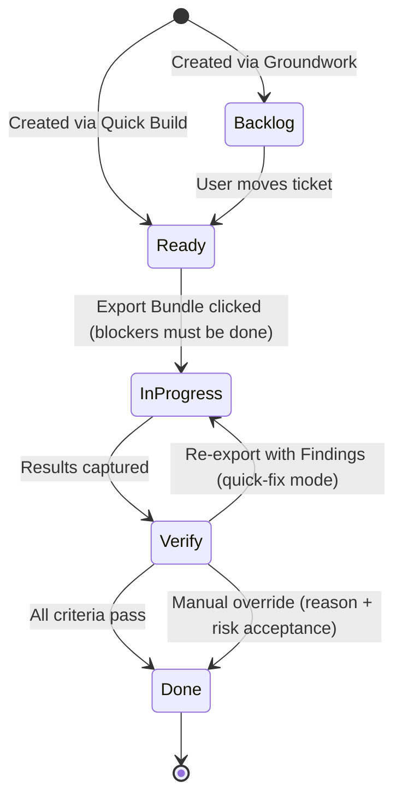
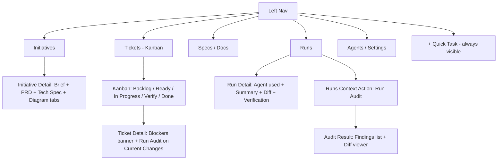

# Workflows - SpecFlow

SpecFlow has four named workflows. Each is a distinct user journey with a clear entry point, a set of user actions, and a defined exit state.

| Workflow | Purpose |
|---|---|
| **Groundwork** | Turn a raw idea into structured specs + an ordered ticket breakdown |
| **Milestone Run** | Execute tickets phase-by-phase with per-ticket verify gates |
| **Quick Build** | Plan and execute a single focused task without a full initiative |
| **Drift Audit** | Review an existing diff and produce structured findings + fix instructions |

---

## Workflow 1 - Groundwork

**Purpose:** Decompose a big idea into a structured initiative: specs, decisions, and an ordered, phase-grouped ticket backlog.

**Entry point:** "New Initiative" button in the Initiatives section of the left nav.

**Steps:**

1. User lands on a blank Initiative page. A large free-text area prompts: *"Describe what you want to build."*
2. User types a free-form description and clicks **Analyze**.
3. The Planner processes the description and renders a set of structured follow-up questions below the description (e.g., *"Who is the primary user?"*, *"What does success look like?"*, *"Are there constraints or non-goals?"*). Each question is a labeled input field.
4. User fills in the structured questions and clicks **Generate Specs**.
5. The Planner generates three documents, shown as tabs on the initiative page: **Brief**, **PRD**, and **Tech Spec**. Each is rendered as editable Markdown.
6. User reviews and edits any section inline. Changes are saved automatically.
7. User clicks **Generate Plan**. The Planner scans the repo (file tree + key config files) to ground the plan in the actual codebase, then produces an ordered ticket breakdown grouped into suggested phases (e.g., *Phase 1 - Foundation*, *Phase 2 - Core Features*). A Mermaid phase-dependency diagram is included.
8. User reviews the phase/ticket list: can rename phases, reorder tickets within a phase, edit ticket titles and descriptions, or delete tickets.
9. User clicks **Create All Tickets**. Tickets are created in **Backlog** status, linked to the initiative. Inter-phase ticket dependencies are wired automatically (Phase N tickets are blocked by Phase N-1 tickets).
10. Initiative page now shows: Brief + specs tabs + Diagram tab + phase-grouped ticket list + empty Runs section.

**Exit:** Initiative is live. All tickets are in Backlog. User proceeds to Milestone Run.

---

## Workflow 2 - Milestone Run

**Purpose:** Execute an initiative's tickets phase-by-phase, with a verify gate after each ticket before moving to the next.

**Entry point:** Initiative page (after Groundwork) or the Kanban board -- user picks a ticket from Backlog or Ready.

**Steps:**

1. User opens a ticket from the Kanban board or the initiative's ticket list. Ticket page shows: description, acceptance criteria, implementation plan, suggested file targets, a blockers banner (if blocked), and a status checklist.
2. User moves the ticket to **Ready** (drag on Kanban or button on ticket page) when they are ready to act on it. If the ticket has unfinished blockers, moving to **In Progress** is rejected with a 409 error listing the blocking tickets.
3. User clicks **Export Bundle**. A panel slides in asking: *"Which agent?"* -- options are Claude Code, Codex CLI, OpenCode, Generic. User selects one.
4. The bundle is generated and displayed: a copy-to-clipboard button and a download link. The ticket moves to **In Progress**. If no git repo is detected, the export step captures an initial file snapshot at the selected scope as the baseline.
5. User runs the agent manually in their terminal (outside SpecFlow). SpecFlow waits.
6. User returns to the ticket page and clicks **Capture Results**.
7. The Capture panel shows:
   - If git is detected: an auto-generated diff preview with a *"Use this diff"* confirmation.
   - If git is not detected: current verification scope (captured at export) plus an optional **widen scope** action.
   - A text area: *"Summarize what the agent did (optional)."*
8. For no-git runs, widened scope is treated as **drift-only** context. Primary verification remains anchored to the initial export-time scope.
9. User confirms and clicks **Submit Results**. Verification runs automatically.
10. The **Verification Panel** appears below the ticket details: each acceptance criterion shows Pass or Fail, a **severity** (Critical/Major/Minor/Outdated), and a **remediation hint** on failure. Drift flags (unexpected file touches, missing requirements, widened-scope drift warnings) are listed separately.
11. **If all pass:** ticket moves to **Done** automatically. User proceeds to the next ticket.
12. **If any fail:** ticket stays in **Verify** status. User gets two actions:
    - **Re-export with Findings** -- generates a new bundle pre-loaded with failure context and remediation hints (quick-fix mode). A "Re-verify Now" button appears after the fix bundle is ready.
    - **Override to Done** -- two-step safeguard: user enters a required reason, then confirms *"I accept risk"*; reason + confirmation are logged in run history.
13. Run history is grouped by ticket with expandable attempts, so retries remain auditable without clutter.
14. If an operation is recovered as `abandoned`, `superseded`, or `failed`, Runs and Ticket detail show a status badge with guided retry actions.
15. Phase guidance is soft. Users can start next-phase tickets early, but SpecFlow shows a warning badge (e.g., *"Starting Phase 2 before Phase 1 is complete"*).
16. When all tickets in a phase are Done, the phase collapses with a complete indicator.

**Exit:** All phases complete -> Initiative is marked Done.

---

## Workflow 3 - Quick Build

**Purpose:** Plan and execute a single focused task without going through a full initiative decomposition.

**Entry point:** The **Quick Task** button -- a persistent `+` icon in the left nav sidebar, always visible regardless of current page.

**Steps:**

1. Clicking Quick Task opens a focused slide-in panel (not a full page). A single prompt: *"What do you need to build?"*
2. User types a brief description (1-3 sentences) and clicks **Plan It**.
3. The Planner triages task size/clarity:
   - If focused and bounded, it continues Quick Build.
   - If too large or ambiguous, SpecFlow auto-converts it into a **draft initiative** and routes the user into Groundwork with the original input prefilled.
4. For focused tasks, the Planner generates: acceptance criteria, a short implementation plan, and suggested file targets.
5. The panel expands to show the generated plan. User can edit acceptance criteria inline (add, remove, or reword items).
6. User clicks **Save as Task**. A ticket is created in **Ready** status (skips Backlog -- it's already scoped). The panel closes and the board scrolls to the new ticket.
7. User opens the ticket and clicks **Export Bundle** -- selects agent, bundle is generated.
8. User runs the agent manually, returns, and clicks **Capture Results** (same capture flow as Milestone Run).
9. Verification runs automatically. Ticket moves to Done or stays in Verify with findings.

**Notes:**
- Quick Tasks appear in the Kanban board without an initiative badge.
- A Quick Task can be linked to an existing initiative later via the ticket's detail page.

---

## Workflow 4 - Drift Audit

**Purpose:** Point SpecFlow at an existing diff or branch and receive structured findings -- categorized issues, severity ratings, and actionable fix instructions.

**Entry points:**
- **Runs page:** user clicks **Run Audit** as a contextual action.
- **Ticket page:** user clicks **Run Audit on Current Changes** as a contextual action.

**Steps:**

1. User triggers audit from either Runs or a Ticket page contextual action.
2. User selects a diff source from a segmented control: **Current git diff** / **Git branch** / **Commit range** / **File snapshot**.
3. When launched from a Ticket page, default scope is prefilled to **ticket file targets + currently changed files** (user can adjust before running).
4. (Optional) User links the audit to an existing ticket. Linking provides acceptance criteria as additional context for the LLM reviewer.
5. If no git repo is present, user selects folders/files for snapshot comparison scope before running the audit.
6. User clicks **Run Audit**. When an API key is configured, an LLM reviewer analyzes the diff against the ticket criteria and `specflow/AGENTS.md` conventions. Without an API key, keyword-based analysis is used as a fallback.
7. Findings are displayed in a two-panel layout:
   - **Left:** Categorized findings list -- each item shows category (Bug / Performance / Security / Clarity / Drift / Acceptance / Convention), severity badge (Error / Warning / Info), confidence score, description, and affected file.
   - **Right:** Unified diff viewer with finding markers in the gutter -- clicking a marker highlights the corresponding finding on the left.
8. For each finding, the user can:
   - **Create Ticket** -- opens a pre-filled Quick Task panel with the finding as the task description.
   - **Export Fix Bundle (Quick Fix)** -- generates an agent bundle targeting only that finding, writing linkage metadata to the run attempt (source run + finding ID).
   - **Dismiss** -- marks the finding as acknowledged (with a required note).
9. The completed audit is saved to the **Runs** section with a timestamp, diff source label, finding count, and any dismissal notes.
10. If audit generation or staged commit recovery lands in `abandoned`, `superseded`, or `failed`, Runs shows explicit status badges and guided retry actions.

---

## Ticket Lifecycle (State Machine)

---

## Board Navigation Structure

