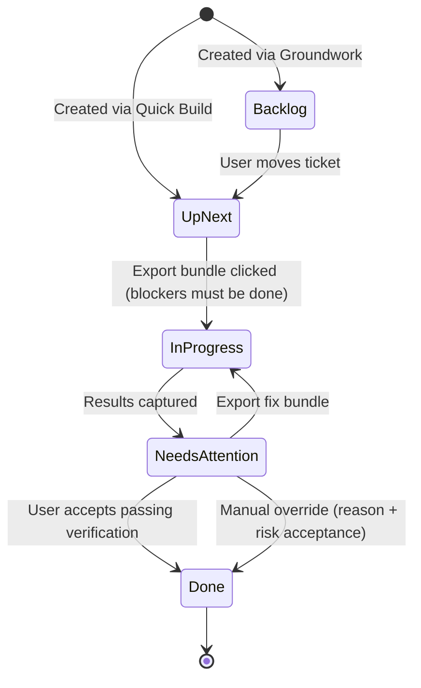
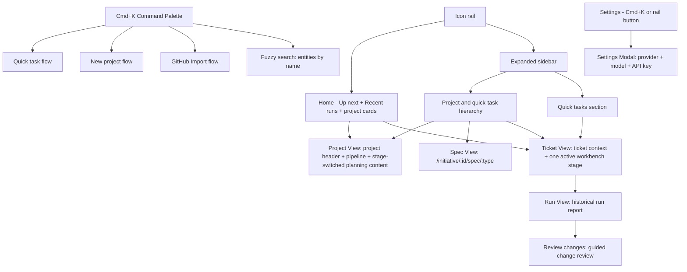

# Workflows - SpecFlow

SpecFlow has four named workflows. Each is a distinct user journey with a clear entry point, a set of user actions, and a defined exit state.

Related docs:

- For setup and command entry points, see [`../README.md`](../README.md)
- For desktop runtime behavior, see [`runtime-modes.md`](runtime-modes.md)
- For implementation architecture behind these flows, see [`architecture.md`](architecture.md)
- For canonical product and UI wording, see [`product-language-spec.md`](product-language-spec.md)

| Workflow          | Purpose                                                                    |
| ----------------- | -------------------------------------------------------------------------- |
| **Groundwork**    | Turn a raw idea into structured specs + an ordered ticket breakdown        |
| **Milestone Run** | Execute tickets phase-by-phase with per-ticket verify gates                |
| **Quick Build**   | Plan and execute a single focused task without a full project              |
| **Drift Audit**   | Review an existing diff and produce structured findings + fix instructions |

---

## Workflow 1 - Groundwork

**Purpose:** Decompose a big idea into a structured project: specs, review gates, decisions, and an ordered, phase-grouped ticket backlog. Groundwork treats information architecture, workflow clarity, progressive disclosure, and system feedback as first-class planning requirements instead of later polish.

**Entry point:** Press **Cmd+K** and select **New project**, or choose **Project** from Home's new-work chooser.

**Steps:**

1. User lands in the same planning shell they will use for the full journey. On a brand-new workspace, Home shows a focused new-work chooser with **Project** and **Quick task** entry points instead of a dead-end empty state. Once work exists, Home stays light with **Up next**, **Recent runs**, and stable project cards, while the project pipeline becomes project-local orientation chrome once the user is inside project planning.
2. Before the first brief starts, the entry screen asks the user to choose a **Project folder**. SpecFlow binds that project to the selected repo or folder, then the user types a free-form idea and continues directly into **Brief intake** in the same screen. The entry card keeps both the idea and the selected folder visible so the user knows what codebase SpecFlow will scan and verify against.
3. Fresh projects always begin with **Brief intake**. SpecFlow asks a required four-question consultation before the first brief can be generated. The questions lock the primary problem, primary user, cross-cutting success qualities, and hard boundaries for v1. The intake should separate the dominant pain from the quality bars that define a good first release instead of asking the same thing twice with different wording.
4. Once the intake is answered or explicitly deferred, the user generates the Brief. SpecFlow then runs a **Brief review** artifact, but the main path remains the artifact review screen rather than a separate blocking checkpoint surface. From review, `Back` should always mean "go to the previous stage." The primary forward action on those review and handoff surfaces should read `Continue`; the pipeline already names the destination. Reopening the answered Brief intake inline should use an explicit action such as `Revise answers` instead of overloading `Back`.
5. User moves into **Core flows**. Before the first draft, the planner runs a required short consultation that locks the primary flow, a meaningful branch or destructive path, and a flow condition that changes the map. The flow can be user-facing, operator-facing, or system/process-facing; it is not limited to screen flows. Later checks can add one targeted failure or degraded-path follow-up when needed. The user then generates the Core flows artifact. **Review core flows** and **Cross-check brief and core flows** remain available as secondary review artifacts instead of primary navigation gates. From review, `Back` should still mean "go to the previous stage." Reopening the answered Core flows survey should use an explicit action such as `Revise answers`, and the final action becomes `Update core flows`.
6. User moves into **PRD**. Before the first draft, the planner asks one required scope-setting question. Later PRD checks can ask up to three more targeted blockers about user-visible behavior, governing rules, v1 priorities, non-goals, failure behavior, performance promises, or compatibility promises before the user generates the PRD. If a PRD question reopens an earlier concern, it must point back to the earlier blocker explicitly and the UI should show that earlier question and answer inline so the user knows what is being revisited. **Review PRD** plus **Cross-check core flows and PRD** remain secondary review artifacts on the document review surface.
7. User moves into **Tech spec**. Before the first draft, the planner asks one required architecture question. Later checks can ask up to four more targeted blockers about implementation tradeoffs such as data flow, existing-system constraints, compatibility, failure handling, performance, operations, risk, and quality strategy before the user generates the Tech spec. If a Tech spec question reopens an earlier concern, it must point back to the earlier blocker explicitly and the review/question surface should show that earlier provenance instead of treating it like a brand-new blocker. **Review tech spec**, **Cross-check PRD and tech spec**, and the **spec-set review** remain secondary review artifacts instead of blocking the next artifact-phase handoff. Once the Tech spec draft is ready, the primary handoff action becomes **Continue**.
8. That action enters **Validation** and starts draft ticket planning in one move. The Planner scans the repo (file tree plus key config files) to ground the plan in the actual codebase, then produces a draft ticket breakdown grouped into suggested phases plus an explicit spec-to-ticket coverage ledger. Ticket planning must preserve the user workflow, information hierarchy, feedback states, and other design-critical work implied by the earlier artifacts instead of treating them as optional polish. Validation owns the last planning gate before tickets are committed.
9. If Validation finds actionable gaps, it should keep the user in **Validation** and turn those gaps into in-place follow-up questions tied back to Brief, Core flows, PRD, or Tech spec. The user should not be forced backward to answer them. Only if the blockers cannot be turned into answerable questions should Validation fall back to a compact blocked summary with a clear override path.
10. Once Validation passes or is explicitly overridden, SpecFlow commits the ticket plan and moves into **Tickets**. Tickets should read as a phase-based ticket board: keep the ordered phases visible, use a labeled **Phase** selector, and show the selected phase as a status-based kanban board using the existing ticket states. Clicking a ticket should open the ticket workspace directly. Tickets should not own planning blockers, review questions, or coverage dumps anymore.
11. The project shell keeps each step in one visible stage: **Consult**, **Draft**, **Checkpoint**, or **Complete**. Generated artifacts default to a focused summary, while full document views and review findings stay behind secondary actions instead of flooding the main page. Completed planning steps retain their asked-question history so users can deliberately reopen the exact answered survey for targeted revisions without reconstructing a fresh intake state, but that entry should use an explicit action such as `Revise answers` rather than `Back`. The inline survey should advance only through unresolved questions, keep the current answer open until the user chooses **Continue**, and avoid resurfacing already answered blockers after a save or phase check. On review and handoff surfaces inside the project shell, stage-navigation buttons should stay generic: `Back` and `Continue`. Resume links and bare project routes should restore the last meaningful planning surface for the current phase: review by default after generation, or questions if the user deliberately went back into revision. When the phase is checking for more questions or generating the next artifact, the waiting state should name the active phase directly, for example `Checking PRD questions...`, `Generating PRD...`, or `Validating plan...`, instead of falling back to generic loading copy.
12. The top-level workspace stays light by default: a collapsed icon rail for app-level actions, **Up next** plus **Recent runs** on Home, and an in-place expandable sidebar that reveals the full project and quick-task hierarchy as a stable object navigator without opening a second panel.

**Exit:** Project is ready for execution once Validation passes or is overridden and the phase-based ticket board is committed. All tickets are in Backlog. User proceeds to Milestone Run.

---

## Workflow 2 - Milestone Run

**Purpose:** Execute a project's tickets phase-by-phase, with a verify gate after each ticket before moving to the next.

**Entry point:** Project page (after Groundwork), Home's Up next queue, or the expanded left sidebar.

**Steps:**

1. User opens a ticket from a project, the Home queue, or the expanded left sidebar. From the project Tickets board, clicking a ticket opens the ticket workspace directly. The ticket view should read as one guided task workspace: a persistent ticket-context panel on the left, one dominant workbench stage on the right, and deeper technical detail behind secondary disclosure.
2. Manual ticket status is available both on the project Tickets board and in the ticket context panel. Users can change status at any time as a management action. Status changes do not bypass export or verification gating; unresolved blockers and Validation issues still block bundle export.
3. In the ticket workspace, the first dominant stage is **Handoff**. The user chooses which agent should receive the handoff bundle: Claude Code, Codex CLI, OpenCode, or Generic, then clicks **Create bundle**. For project-linked tickets, unresolved Validation blockers still block export until the user resolves or overrides them in the project view.
4. The bundle is generated and the ticket moves to **In progress**. The user can copy the bundle immediately. The desktop app also offers a native **Save ZIP bundle** action. Raw bundle preview and Markdown download stay behind **Bundle tools**. If no git repo is detected, the export step captures an initial file snapshot at the selected scope as the baseline.
5. User runs the agent manually in their terminal (outside SpecFlow). SpecFlow waits in a minimal handoff-complete state.
6. When returned work is detected, SpecFlow moves into **Verification** automatically and runs the ticket check without a separate manual review step.
7. The default **Verification** surface stays verdict-first. It shows the overall verdict, changed-file count, unexpected-change count, and one primary decision. Detailed file inspection lives behind **Review changes** instead of on the main ticket page.
8. For no-git runs, widened scope remains drift-only context in the verification and review flows. Primary verification stays anchored to the initial export-time scope.
9. The **Verification** stage shows one of two states:
   - Pass: SpecFlow shows **Accept** as the primary action. Secondary actions are **View run report** and **Review changes**.
   - Fail: each failed acceptance criterion shows severity plus remediation hint, drift flags are listed separately in details, and the primary action becomes **Export fix bundle**.
10. **If the user accepts a pass:** ticket moves to **Done**. User proceeds to the next ticket.
11. **If verification fails:** ticket stays in **Needs attention** status. User gets two follow-up paths:
    - **Export fix bundle** -- generates a new bundle pre-loaded with failure context and remediation hints (quick-fix mode).
    - **Mark done with risk** -- stays behind secondary disclosure, requires a reason, and then records the accepted-risk decision in run history.
12. Run history is grouped by ticket with expandable attempts, so retries remain auditable without clutter. The ticket page stays ticket-first: a context panel, a compact `Handoff / Verification` strip, one active workbench stage, and a plain-language brief that foregrounds the goal and must-haves before exposing technical detail.
13. Resume and re-entry should return project work to the active ticket, not to a run report. Explicit run-detail visits remain historical drill-down only; they do not replace the project's execution resume target, and they should not reintroduce the full project pipeline as competing workflow chrome.
14. If an operation is recovered as `abandoned`, `superseded`, or `failed`, Runs and Ticket detail show a status badge with guided retry actions.
15. Phase guidance is soft. Users can start next-phase tickets early, but SpecFlow shows the warning in the ticket preflight instead of scattering it across multiple banners.
16. When all tickets in a phase are Done, the phase collapses with a complete indicator.

**Exit:** All phases complete -> Project is marked Done.

---

## Workflow 3 - Quick Build

**Purpose:** Plan and execute a single focused task without going through a full project decomposition.

**Entry point:** Press **Cmd+K** and select **Quick task**, or open the new-work chooser and select **Quick task**.

**Steps:**

1. The user opens Quick task from Cmd+K or the new-work chooser. The UI uses the same contained shell language as planning, but with a shorter path.
2. User types a brief description (1-3 sentences) and clicks **Continue**.
3. The Planner triages task size/clarity:
   - If focused and bounded, it continues Quick Build.
   - If too large or ambiguous, SpecFlow auto-converts it into a **draft project** and routes the user into Groundwork with the original input prefilled.
4. For focused tasks, the Planner generates: acceptance criteria, a short implementation plan, and suggested file targets.
5. A ticket is created in **Up next** status (skips Backlog -- it's already scoped). The command palette closes and the workspace navigates directly to the new ticket.
6. User opens the ticket and clicks **Create bundle** -- selects agent, bundle is generated.
7. User runs the agent manually and returns. Verification uses the active workspace root the task was created against and starts automatically when returned work is detected.
8. If the verification passes, the user accepts the run to mark the ticket done. If it fails, the ticket stays in **Needs attention** with findings and a fix-bundle path.

**Notes:**

- Quick tasks remain outside projects and are still browseable from the expanded left sidebar and aggregate ticket views.
- A Quick task can be linked to an existing project later via the ticket's detail page.
- Quick tasks are exempt from project coverage gating until they are linked to a project.

---

## Workflow 4 - Drift Audit

**Purpose:** Point SpecFlow at an existing diff or branch and receive structured findings -- categorized issues, severity ratings, and actionable fix instructions.

**Entry points:**

- **Run view:** user clicks **Review changes** as a contextual action from within a run report.
- **Ticket view:** user opens the linked run report and uses **Review changes** there.

**Steps:**

1. User triggers audit from either Runs or a Ticket page contextual action.
2. User starts with the default review for the run. If that baseline is wrong, they open **Review options** and switch the comparison source to **Git branch**, **Commit range**, or **File snapshot**.
3. Default scope is prefilled from the run and linked ticket context. The user only adjusts it when they need a narrower or wider review than the default run context.
4. (Optional) User links the audit to an existing ticket. Linking provides acceptance criteria as additional context for the LLM reviewer.
5. If no git repo is present, user selects folders/files for snapshot comparison scope before running the audit.
6. User clicks **Review changes**. When an API key is configured, an LLM reviewer analyzes the diff against the ticket criteria and `specflow/AGENTS.md` conventions. Without an API key, keyword-based analysis is used as a fallback.
7. Findings are displayed in a guided review layout:
   - **Left:** Categorized findings list -- each item shows category, severity badge, confidence score, description, and affected file.
   - **Right:** One selected finding at a time, with follow-up actions first and diff context behind secondary disclosure.
8. For each finding, the user can:
   - **Create follow-up ticket** -- opens a focused task seeded from the finding.
   - **Export fix bundle** -- generates an agent bundle targeting only that finding, writing linkage metadata to the run attempt (source run + finding ID).
   - **Dismiss** -- marks the finding as acknowledged (with a required note).
9. Diff context and advanced compare controls remain available, but they stay behind explicit disclosure so the default review stays focused on findings and next actions.
10. The completed audit is saved to the **Runs** section with a timestamp, diff source label, finding count, and any dismissal notes.
11. If audit generation or staged commit recovery lands in `abandoned`, `superseded`, or `failed`, Runs shows explicit status badges and guided retry actions.

---

## Ticket Lifecycle (State Machine)

---

## Board Navigation Structure

